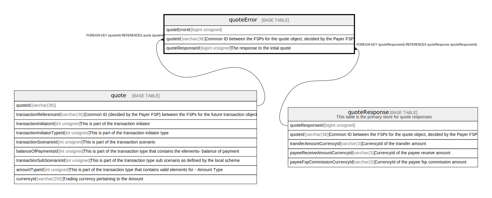

# quoteError

## Description

<details>
<summary><strong>Table Definition</strong></summary>

```sql
CREATE TABLE `quoteError` (
  `quoteErrorId` bigint unsigned NOT NULL AUTO_INCREMENT,
  `quoteId` varchar(36) NOT NULL COMMENT 'Common ID between the FSPs for the quote object, decided by the Payer FSP',
  `quoteResponseId` bigint unsigned DEFAULT NULL COMMENT 'The response to the intial quote',
  `errorCode` int unsigned NOT NULL,
  `errorDescription` varchar(128) NOT NULL,
  `createdDate` datetime NOT NULL DEFAULT CURRENT_TIMESTAMP,
  PRIMARY KEY (`quoteErrorId`),
  KEY `quoteerror_quoteid_foreign` (`quoteId`),
  KEY `quoteerror_quoteresponseid_foreign` (`quoteResponseId`),
  CONSTRAINT `quoteerror_quoteid_foreign` FOREIGN KEY (`quoteId`) REFERENCES `quote` (`quoteId`),
  CONSTRAINT `quoteerror_quoteresponseid_foreign` FOREIGN KEY (`quoteResponseId`) REFERENCES `quoteResponse` (`quoteResponseId`)
) ENGINE=InnoDB DEFAULT CHARSET=utf8mb4 COLLATE=utf8mb4_0900_ai_ci
```

</details>

## Columns

| Name | Type | Default | Nullable | Extra Definition | Children | Parents | Comment |
| ---- | ---- | ------- | -------- | ---------------- | -------- | ------- | ------- |
| quoteErrorId | bigint unsigned |  | false | auto_increment |  |  |  |
| quoteId | varchar(36) |  | false |  |  | [quote](quote.md) | Common ID between the FSPs for the quote object, decided by the Payer FSP |
| quoteResponseId | bigint unsigned |  | true |  |  | [quoteResponse](quoteResponse.md) | The response to the intial quote |
| errorCode | int unsigned |  | false |  |  |  |  |
| errorDescription | varchar(128) |  | false |  |  |  |  |
| createdDate | datetime | CURRENT_TIMESTAMP | false | DEFAULT_GENERATED |  |  |  |

## Constraints

| Name | Type | Definition |
| ---- | ---- | ---------- |
| PRIMARY | PRIMARY KEY | PRIMARY KEY (quoteErrorId) |
| quoteerror_quoteid_foreign | FOREIGN KEY | FOREIGN KEY (quoteId) REFERENCES quote (quoteId) |
| quoteerror_quoteresponseid_foreign | FOREIGN KEY | FOREIGN KEY (quoteResponseId) REFERENCES quoteResponse (quoteResponseId) |

## Indexes

| Name | Definition |
| ---- | ---------- |
| quoteerror_quoteid_foreign | KEY quoteerror_quoteid_foreign (quoteId) USING BTREE |
| quoteerror_quoteresponseid_foreign | KEY quoteerror_quoteresponseid_foreign (quoteResponseId) USING BTREE |
| PRIMARY | PRIMARY KEY (quoteErrorId) USING BTREE |

## Relations



---

> Generated by [tbls](https://github.com/k1LoW/tbls)
