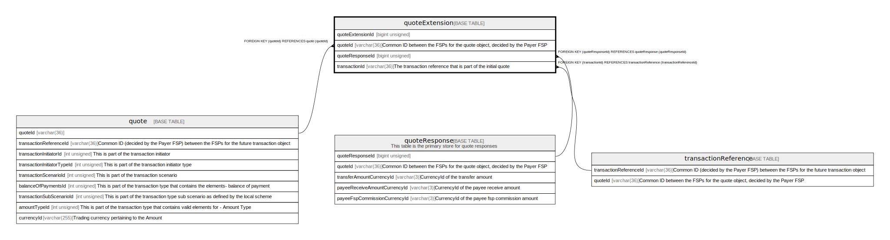

# quoteExtension

## Description

<details>
<summary><strong>Table Definition</strong></summary>

```sql
CREATE TABLE `quoteExtension` (
  `quoteExtensionId` bigint unsigned NOT NULL AUTO_INCREMENT,
  `quoteId` varchar(36) NOT NULL COMMENT 'Common ID between the FSPs for the quote object, decided by the Payer FSP',
  `quoteResponseId` bigint unsigned DEFAULT NULL,
  `transactionId` varchar(36) DEFAULT NULL COMMENT 'The transaction reference that is part of the initial quote',
  `key` varchar(128) NOT NULL,
  `value` text CHARACTER SET utf8mb4 COLLATE utf8mb4_unicode_ci NOT NULL,
  `createdDate` datetime NOT NULL DEFAULT CURRENT_TIMESTAMP COMMENT 'System dateTime stamp pertaining to the inserted record',
  PRIMARY KEY (`quoteExtensionId`),
  KEY `quoteextension_quoteid_foreign` (`quoteId`),
  KEY `quoteextension_quoteresponseid_foreign` (`quoteResponseId`),
  KEY `quoteextension_transactionid_foreign` (`transactionId`),
  CONSTRAINT `quoteextension_quoteid_foreign` FOREIGN KEY (`quoteId`) REFERENCES `quote` (`quoteId`),
  CONSTRAINT `quoteextension_quoteresponseid_foreign` FOREIGN KEY (`quoteResponseId`) REFERENCES `quoteResponse` (`quoteResponseId`),
  CONSTRAINT `quoteextension_transactionid_foreign` FOREIGN KEY (`transactionId`) REFERENCES `transactionReference` (`transactionReferenceId`)
) ENGINE=InnoDB DEFAULT CHARSET=utf8mb4 COLLATE=utf8mb4_0900_ai_ci
```

</details>

## Columns

| Name             | Type            | Default           | Nullable | Extra Definition  | Parents                                         | Comment                                                                   |
| ---------------- | --------------- | ----------------- | -------- | ----------------- | ----------------------------------------------- | ------------------------------------------------------------------------- |
| quoteExtensionId | bigint unsigned |                   | false    | auto_increment    |                                                 |                                                                           |
| quoteId          | varchar(36)     |                   | false    |                   | [quote](quote.md)                               | Common ID between the FSPs for the quote object, decided by the Payer FSP |
| quoteResponseId  | bigint unsigned |                   | true     |                   | [quoteResponse](quoteResponse.md)               |                                                                           |
| transactionId    | varchar(36)     |                   | true     |                   | [transactionReference](transactionReference.md) | The transaction reference that is part of the initial quote               |
| key              | varchar(128)    |                   | false    |                   |                                                 |                                                                           |
| value            | text            |                   | false    |                   |                                                 |                                                                           |
| createdDate      | datetime        | CURRENT_TIMESTAMP | false    | DEFAULT_GENERATED |                                                 | System dateTime stamp pertaining to the inserted record                   |

## Constraints

| Name                                   | Type        | Definition                                                                           |
| -------------------------------------- | ----------- | ------------------------------------------------------------------------------------ |
| PRIMARY                                | PRIMARY KEY | PRIMARY KEY (quoteExtensionId)                                                       |
| quoteextension_quoteid_foreign         | FOREIGN KEY | FOREIGN KEY (quoteId) REFERENCES quote (quoteId)                                     |
| quoteextension_quoteresponseid_foreign | FOREIGN KEY | FOREIGN KEY (quoteResponseId) REFERENCES quoteResponse (quoteResponseId)             |
| quoteextension_transactionid_foreign   | FOREIGN KEY | FOREIGN KEY (transactionId) REFERENCES transactionReference (transactionReferenceId) |

## Indexes

| Name                                   | Definition                                                               |
| -------------------------------------- | ------------------------------------------------------------------------ |
| quoteextension_quoteid_foreign         | KEY quoteextension_quoteid_foreign (quoteId) USING BTREE                 |
| quoteextension_quoteresponseid_foreign | KEY quoteextension_quoteresponseid_foreign (quoteResponseId) USING BTREE |
| quoteextension_transactionid_foreign   | KEY quoteextension_transactionid_foreign (transactionId) USING BTREE     |
| PRIMARY                                | PRIMARY KEY (quoteExtensionId) USING BTREE                               |

## Relations



---

> Generated by [tbls](https://github.com/k1LoW/tbls)
