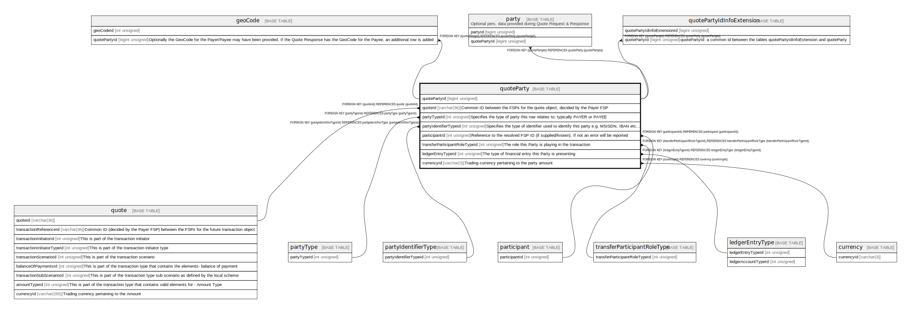

# quoteParty

## Description

<details>
<summary><strong>Table Definition</strong></summary>

```sql
CREATE TABLE `quoteParty` (
  `quotePartyId` bigint unsigned NOT NULL AUTO_INCREMENT,
  `quoteId` varchar(36) NOT NULL COMMENT 'Common ID between the FSPs for the quote object, decided by the Payer FSP',
  `partyTypeId` int unsigned NOT NULL COMMENT 'Specifies the type of party this row relates to; typically PAYER or PAYEE',
  `partyIdentifierTypeId` int unsigned NOT NULL COMMENT 'Specifies the type of identifier used to identify this party e.g. MSISDN, IBAN etc...',
  `partyIdentifierValue` varchar(128) NOT NULL COMMENT 'The value of the identifier used to identify this party',
  `partySubIdOrTypeId` varchar(128) DEFAULT NULL COMMENT 'A sub-identifier or sub-type for the Party',
  `fspId` varchar(255) DEFAULT NULL COMMENT 'This is the FSP ID as provided in the quote. For the switch between multi-parties it is required',
  `participantId` int unsigned DEFAULT NULL COMMENT 'Reference to the resolved FSP ID (if supplied/known). If not an error will be reported',
  `merchantClassificationCode` varchar(4) DEFAULT NULL COMMENT 'Used in the context of Payee Information, where the Payee happens to be a merchant accepting merchant payments',
  `partyName` varchar(128) DEFAULT NULL COMMENT 'Display name of the Party, could be a real name or a nick name',
  `transferParticipantRoleTypeId` int unsigned NOT NULL COMMENT 'The role this Party is playing in the transaction',
  `ledgerEntryTypeId` int unsigned NOT NULL COMMENT 'The type of financial entry this Party is presenting',
  `amount` decimal(18,4) NOT NULL,
  `currencyId` varchar(3) NOT NULL COMMENT 'Trading currency pertaining to the party amount',
  `createdDate` datetime NOT NULL DEFAULT CURRENT_TIMESTAMP COMMENT 'System dateTime stamp pertaining to the inserted record',
  PRIMARY KEY (`quotePartyId`),
  KEY `quoteparty_quoteid_foreign` (`quoteId`),
  KEY `quoteparty_partytypeid_foreign` (`partyTypeId`),
  KEY `quoteparty_partyidentifiertypeid_foreign` (`partyIdentifierTypeId`),
  KEY `quoteparty_partysubidortypeid_foreign` (`partySubIdOrTypeId`),
  KEY `quoteparty_participantid_foreign` (`participantId`),
  KEY `quoteparty_transferparticipantroletypeid_foreign` (`transferParticipantRoleTypeId`),
  KEY `quoteparty_ledgerentrytypeid_foreign` (`ledgerEntryTypeId`),
  KEY `quoteparty_currencyid_foreign` (`currencyId`),
  CONSTRAINT `quoteparty_currencyid_foreign` FOREIGN KEY (`currencyId`) REFERENCES `currency` (`currencyId`),
  CONSTRAINT `quoteparty_ledgerentrytypeid_foreign` FOREIGN KEY (`ledgerEntryTypeId`) REFERENCES `ledgerEntryType` (`ledgerEntryTypeId`),
  CONSTRAINT `quoteparty_participantid_foreign` FOREIGN KEY (`participantId`) REFERENCES `participant` (`participantId`),
  CONSTRAINT `quoteparty_partyidentifiertypeid_foreign` FOREIGN KEY (`partyIdentifierTypeId`) REFERENCES `partyIdentifierType` (`partyIdentifierTypeId`),
  CONSTRAINT `quoteparty_partytypeid_foreign` FOREIGN KEY (`partyTypeId`) REFERENCES `partyType` (`partyTypeId`),
  CONSTRAINT `quoteparty_quoteid_foreign` FOREIGN KEY (`quoteId`) REFERENCES `quote` (`quoteId`),
  CONSTRAINT `quoteparty_transferparticipantroletypeid_foreign` FOREIGN KEY (`transferParticipantRoleTypeId`) REFERENCES `transferParticipantRoleType` (`transferParticipantRoleTypeId`)
) ENGINE=InnoDB DEFAULT CHARSET=utf8mb4 COLLATE=utf8mb4_0900_ai_ci
```

</details>

## Columns

| Name                          | Type            | Default           | Nullable | Extra Definition  | Children                                                                                          | Parents                                                       | Comment                                                                                                        |
| ----------------------------- | --------------- | ----------------- | -------- | ----------------- | ------------------------------------------------------------------------------------------------- | ------------------------------------------------------------- | -------------------------------------------------------------------------------------------------------------- |
| quotePartyId                  | bigint unsigned |                   | false    | auto_increment    | [geoCode](geoCode.md) [party](party.md) [quotePartyIdInfoExtension](quotePartyIdInfoExtension.md) |                                                               |                                                                                                                |
| quoteId                       | varchar(36)     |                   | false    |                   |                                                                                                   | [quote](quote.md)                                             | Common ID between the FSPs for the quote object, decided by the Payer FSP                                      |
| partyTypeId                   | int unsigned    |                   | false    |                   |                                                                                                   | [partyType](partyType.md)                                     | Specifies the type of party this row relates to; typically PAYER or PAYEE                                      |
| partyIdentifierTypeId         | int unsigned    |                   | false    |                   |                                                                                                   | [partyIdentifierType](partyIdentifierType.md)                 | Specifies the type of identifier used to identify this party e.g. MSISDN, IBAN etc...                          |
| partyIdentifierValue          | varchar(128)    |                   | false    |                   |                                                                                                   |                                                               | The value of the identifier used to identify this party                                                        |
| partySubIdOrTypeId            | varchar(128)    |                   | true     |                   |                                                                                                   |                                                               | A sub-identifier or sub-type for the Party                                                                     |
| fspId                         | varchar(255)    |                   | true     |                   |                                                                                                   |                                                               | This is the FSP ID as provided in the quote. For the switch between multi-parties it is required               |
| participantId                 | int unsigned    |                   | true     |                   |                                                                                                   | [participant](participant.md)                                 | Reference to the resolved FSP ID (if supplied/known). If not an error will be reported                         |
| merchantClassificationCode    | varchar(4)      |                   | true     |                   |                                                                                                   |                                                               | Used in the context of Payee Information, where the Payee happens to be a merchant accepting merchant payments |
| partyName                     | varchar(128)    |                   | true     |                   |                                                                                                   |                                                               | Display name of the Party, could be a real name or a nick name                                                 |
| transferParticipantRoleTypeId | int unsigned    |                   | false    |                   |                                                                                                   | [transferParticipantRoleType](transferParticipantRoleType.md) | The role this Party is playing in the transaction                                                              |
| ledgerEntryTypeId             | int unsigned    |                   | false    |                   |                                                                                                   | [ledgerEntryType](ledgerEntryType.md)                         | The type of financial entry this Party is presenting                                                           |
| amount                        | decimal(18,4)   |                   | false    |                   |                                                                                                   |                                                               |                                                                                                                |
| currencyId                    | varchar(3)      |                   | false    |                   |                                                                                                   | [currency](currency.md)                                       | Trading currency pertaining to the party amount                                                                |
| createdDate                   | datetime        | CURRENT_TIMESTAMP | false    | DEFAULT_GENERATED |                                                                                                   |                                                               | System dateTime stamp pertaining to the inserted record                                                        |

## Constraints

| Name                                             | Type        | Definition                                                                                                         |
| ------------------------------------------------ | ----------- | ------------------------------------------------------------------------------------------------------------------ |
| PRIMARY                                          | PRIMARY KEY | PRIMARY KEY (quotePartyId)                                                                                         |
| quoteparty_currencyid_foreign                    | FOREIGN KEY | FOREIGN KEY (currencyId) REFERENCES currency (currencyId)                                                          |
| quoteparty_ledgerentrytypeid_foreign             | FOREIGN KEY | FOREIGN KEY (ledgerEntryTypeId) REFERENCES ledgerEntryType (ledgerEntryTypeId)                                     |
| quoteparty_participantid_foreign                 | FOREIGN KEY | FOREIGN KEY (participantId) REFERENCES participant (participantId)                                                 |
| quoteparty_partyidentifiertypeid_foreign         | FOREIGN KEY | FOREIGN KEY (partyIdentifierTypeId) REFERENCES partyIdentifierType (partyIdentifierTypeId)                         |
| quoteparty_partytypeid_foreign                   | FOREIGN KEY | FOREIGN KEY (partyTypeId) REFERENCES partyType (partyTypeId)                                                       |
| quoteparty_quoteid_foreign                       | FOREIGN KEY | FOREIGN KEY (quoteId) REFERENCES quote (quoteId)                                                                   |
| quoteparty_transferparticipantroletypeid_foreign | FOREIGN KEY | FOREIGN KEY (transferParticipantRoleTypeId) REFERENCES transferParticipantRoleType (transferParticipantRoleTypeId) |

## Indexes

| Name                                             | Definition                                                                                       |
| ------------------------------------------------ | ------------------------------------------------------------------------------------------------ |
| quoteparty_currencyid_foreign                    | KEY quoteparty_currencyid_foreign (currencyId) USING BTREE                                       |
| quoteparty_ledgerentrytypeid_foreign             | KEY quoteparty_ledgerentrytypeid_foreign (ledgerEntryTypeId) USING BTREE                         |
| quoteparty_participantid_foreign                 | KEY quoteparty_participantid_foreign (participantId) USING BTREE                                 |
| quoteparty_partyidentifiertypeid_foreign         | KEY quoteparty_partyidentifiertypeid_foreign (partyIdentifierTypeId) USING BTREE                 |
| quoteparty_partysubidortypeid_foreign            | KEY quoteparty_partysubidortypeid_foreign (partySubIdOrTypeId) USING BTREE                       |
| quoteparty_partytypeid_foreign                   | KEY quoteparty_partytypeid_foreign (partyTypeId) USING BTREE                                     |
| quoteparty_quoteid_foreign                       | KEY quoteparty_quoteid_foreign (quoteId) USING BTREE                                             |
| quoteparty_transferparticipantroletypeid_foreign | KEY quoteparty_transferparticipantroletypeid_foreign (transferParticipantRoleTypeId) USING BTREE |
| PRIMARY                                          | PRIMARY KEY (quotePartyId) USING BTREE                                                           |

## Relations



---

> Generated by [tbls](https://github.com/k1LoW/tbls)
