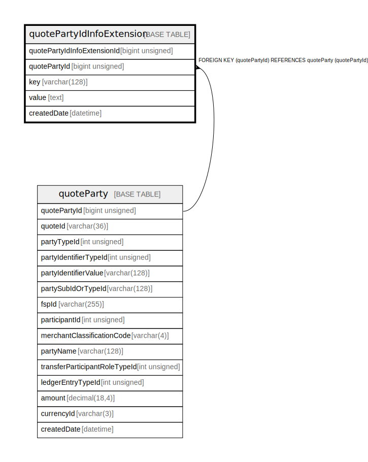

# quotePartyIdInfoExtension

## Description

<details>
<summary><strong>Table Definition</strong></summary>

```sql
CREATE TABLE `quotePartyIdInfoExtension` (
  `quotePartyIdInfoExtensionId` bigint unsigned NOT NULL AUTO_INCREMENT,
  `quotePartyId` bigint unsigned NOT NULL COMMENT 'quotePartyId: a common id between the tables quotePartyIdInfoExtension and quoteParty',
  `key` varchar(128) COLLATE utf8mb4_unicode_ci NOT NULL,
  `value` text COLLATE utf8mb4_unicode_ci NOT NULL,
  `createdDate` datetime NOT NULL DEFAULT CURRENT_TIMESTAMP COMMENT 'System dateTime stamp pertaining to the inserted record',
  PRIMARY KEY (`quotePartyIdInfoExtensionId`),
  KEY `quotepartyidinfoextension_quotepartyid_foreign` (`quotePartyId`),
  CONSTRAINT `quotepartyidinfoextension_quotepartyid_foreign` FOREIGN KEY (`quotePartyId`) REFERENCES `quoteParty` (`quotePartyId`)
) ENGINE=InnoDB DEFAULT CHARSET=utf8mb4 COLLATE=utf8mb4_unicode_ci
```

</details>

## Columns

| Name | Type | Default | Nullable | Extra Definition | Children | Parents | Comment |
| ---- | ---- | ------- | -------- | ---------------- | -------- | ------- | ------- |
| quotePartyIdInfoExtensionId | bigint unsigned |  | false | auto_increment |  |  |  |
| quotePartyId | bigint unsigned |  | false |  |  | [quoteParty](quoteParty.md) | quotePartyId: a common id between the tables quotePartyIdInfoExtension and quoteParty |
| key | varchar(128) |  | false |  |  |  |  |
| value | text |  | false |  |  |  |  |
| createdDate | datetime | CURRENT_TIMESTAMP | false | DEFAULT_GENERATED |  |  | System dateTime stamp pertaining to the inserted record |

## Constraints

| Name | Type | Definition |
| ---- | ---- | ---------- |
| PRIMARY | PRIMARY KEY | PRIMARY KEY (quotePartyIdInfoExtensionId) |
| quotepartyidinfoextension_quotepartyid_foreign | FOREIGN KEY | FOREIGN KEY (quotePartyId) REFERENCES quoteParty (quotePartyId) |

## Indexes

| Name | Definition |
| ---- | ---------- |
| quotepartyidinfoextension_quotepartyid_foreign | KEY quotepartyidinfoextension_quotepartyid_foreign (quotePartyId) USING BTREE |
| PRIMARY | PRIMARY KEY (quotePartyIdInfoExtensionId) USING BTREE |

## Relations



---

> Generated by [tbls](https://github.com/k1LoW/tbls)
