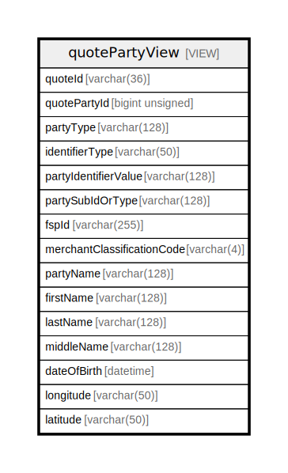

# quotePartyView

## Description

VIEW

<details>
<summary><strong>Table Definition</strong></summary>

```sql
CREATE VIEW quotePartyView AS (select `qp`.`quoteId` AS `quoteId`,`qp`.`quotePartyId` AS `quotePartyId`,`pt`.`name` AS `partyType`,`pit`.`name` AS `identifierType`,`qp`.`partyIdentifierValue` AS `partyIdentifierValue`,`qp`.`partySubIdOrTypeId` AS `partySubIdOrType`,`qp`.`fspId` AS `fspId`,`qp`.`merchantClassificationCode` AS `merchantClassificationCode`,`qp`.`partyName` AS `partyName`,`p`.`firstName` AS `firstName`,`p`.`lastName` AS `lastName`,`p`.`middleName` AS `middleName`,`p`.`dateOfBirth` AS `dateOfBirth`,`gc`.`longitude` AS `longitude`,`gc`.`latitude` AS `latitude` from ((((`central_ledger`.`quoteParty` `qp` join `central_ledger`.`partyType` `pt` on((`pt`.`partyTypeId` = `qp`.`partyTypeId`))) join `central_ledger`.`partyIdentifierType` `pit` on((`pit`.`partyIdentifierTypeId` = `qp`.`partyIdentifierTypeId`))) left join `central_ledger`.`party` `p` on((`p`.`quotePartyId` = `qp`.`quotePartyId`))) left join `central_ledger`.`geoCode` `gc` on((`gc`.`quotePartyId` = `qp`.`quotePartyId`))))
```

</details>

## Columns

| Name | Type | Default | Nullable | Children | Parents | Comment |
| ---- | ---- | ------- | -------- | -------- | ------- | ------- |
| quoteId | varchar(36) |  | false |  |  | Common ID between the FSPs for the quote object, decided by the Payer FSP |
| quotePartyId | bigint unsigned | 0 | false |  |  |  |
| partyType | varchar(128) |  | false |  |  |  |
| identifierType | varchar(50) |  | false |  |  |  |
| partyIdentifierValue | varchar(128) |  | false |  |  | The value of the identifier used to identify this party |
| partySubIdOrType | varchar(128) |  | true |  |  | A sub-identifier or sub-type for the Party |
| fspId | varchar(255) |  | true |  |  | This is the FSP ID as provided in the quote. For the switch between multi-parties it is required |
| merchantClassificationCode | varchar(4) |  | true |  |  | Used in the context of Payee Information, where the Payee happens to be a merchant accepting merchant payments |
| partyName | varchar(128) |  | true |  |  | Display name of the Party, could be a real name or a nick name |
| firstName | varchar(128) |  | true |  |  |  |
| lastName | varchar(128) |  | true |  |  |  |
| middleName | varchar(128) |  | true |  |  |  |
| dateOfBirth | datetime |  | true |  |  |  |
| longitude | varchar(50) |  | true |  |  | Longitude of the initiating Party |
| latitude | varchar(50) |  | true |  |  | Latitude of the initiating Party |

## Referenced Tables

| Name | Columns | Comment | Type |
| ---- | ------- | ------- | ---- |
| [quoteParty](quoteParty.md) | 15 |  | BASE TABLE |
| [partyType](partyType.md) | 3 |  | BASE TABLE |
| [partyIdentifierType](partyIdentifierType.md) | 3 |  | BASE TABLE |
| [party](party.md) | 6 | Optional pers. data provided during Quote Request & Response | BASE TABLE |
| [geoCode](geoCode.md) | 5 |  | BASE TABLE |

## Relations



---

> Generated by [tbls](https://github.com/k1LoW/tbls)
