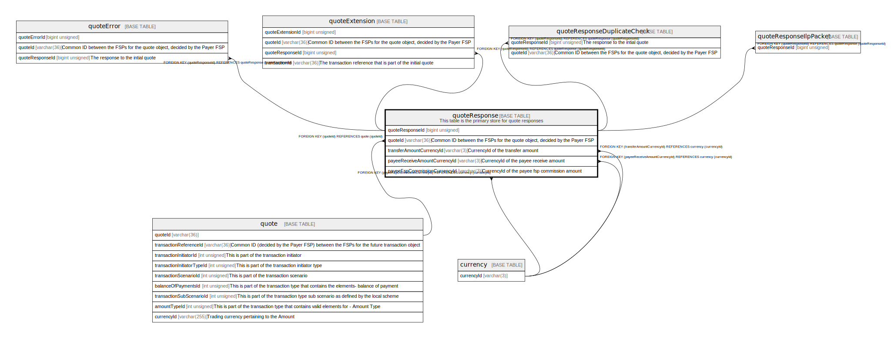

# quoteResponse

## Description

This table is the primary store for quote responses

<details>
<summary><strong>Table Definition</strong></summary>

```sql
CREATE TABLE `quoteResponse` (
  `quoteResponseId` bigint unsigned NOT NULL AUTO_INCREMENT,
  `quoteId` varchar(36) NOT NULL COMMENT 'Common ID between the FSPs for the quote object, decided by the Payer FSP',
  `transferAmountCurrencyId` varchar(3) NOT NULL COMMENT 'CurrencyId of the transfer amount',
  `transferAmount` decimal(18,4) NOT NULL COMMENT 'The amount of money that the Payer FSP should transfer to the Payee FSP',
  `payeeReceiveAmountCurrencyId` varchar(3) DEFAULT NULL COMMENT 'CurrencyId of the payee receive amount',
  `payeeReceiveAmount` decimal(18,4) DEFAULT NULL COMMENT 'The amount of Money that the Payee should receive in the end-to-end transaction. Optional as the Payee FSP might not want to disclose any optional Payee fees',
  `payeeFspFeeCurrencyId` varchar(3) DEFAULT NULL COMMENT 'CurrencyId of the payee fsp fee amount',
  `payeeFspFeeAmount` decimal(18,4) DEFAULT NULL COMMENT 'Payee FSP’s part of the transaction fee',
  `payeeFspCommissionCurrencyId` varchar(3) DEFAULT NULL COMMENT 'CurrencyId of the payee fsp commission amount',
  `payeeFspCommissionAmount` decimal(18,4) DEFAULT NULL COMMENT 'Transaction commission from the Payee FSP',
  `ilpCondition` varchar(256) NOT NULL,
  `responseExpirationDate` datetime DEFAULT NULL COMMENT 'Optional expiration for the requested transaction',
  `isValid` tinyint(1) DEFAULT NULL,
  `createdDate` datetime NOT NULL DEFAULT CURRENT_TIMESTAMP COMMENT 'System dateTime stamp pertaining to the inserted record',
  PRIMARY KEY (`quoteResponseId`),
  KEY `quoteresponse_quoteid_foreign` (`quoteId`),
  KEY `quoteresponse_transferamountcurrencyid_foreign` (`transferAmountCurrencyId`),
  KEY `quoteresponse_payeereceiveamountcurrencyid_foreign` (`payeeReceiveAmountCurrencyId`),
  KEY `quoteresponse_payeefspcommissioncurrencyid_foreign` (`payeeFspCommissionCurrencyId`),
  CONSTRAINT `quoteresponse_payeefspcommissioncurrencyid_foreign` FOREIGN KEY (`payeeFspCommissionCurrencyId`) REFERENCES `currency` (`currencyId`),
  CONSTRAINT `quoteresponse_payeereceiveamountcurrencyid_foreign` FOREIGN KEY (`payeeReceiveAmountCurrencyId`) REFERENCES `currency` (`currencyId`),
  CONSTRAINT `quoteresponse_quoteid_foreign` FOREIGN KEY (`quoteId`) REFERENCES `quote` (`quoteId`),
  CONSTRAINT `quoteresponse_transferamountcurrencyid_foreign` FOREIGN KEY (`transferAmountCurrencyId`) REFERENCES `currency` (`currencyId`)
) ENGINE=InnoDB DEFAULT CHARSET=utf8mb4 COLLATE=utf8mb4_0900_ai_ci COMMENT='This table is the primary store for quote responses'
```

</details>

## Columns

| Name | Type | Default | Nullable | Extra Definition | Children | Parents | Comment |
| ---- | ---- | ------- | -------- | ---------------- | -------- | ------- | ------- |
| quoteResponseId | bigint unsigned |  | false | auto_increment | [quoteError](quoteError.md) [quoteExtension](quoteExtension.md) [quoteResponseDuplicateCheck](quoteResponseDuplicateCheck.md) [quoteResponseIlpPacket](quoteResponseIlpPacket.md) |  |  |
| quoteId | varchar(36) |  | false |  |  | [quote](quote.md) | Common ID between the FSPs for the quote object, decided by the Payer FSP |
| transferAmountCurrencyId | varchar(3) |  | false |  |  | [currency](currency.md) | CurrencyId of the transfer amount |
| transferAmount | decimal(18,4) |  | false |  |  |  | The amount of money that the Payer FSP should transfer to the Payee FSP |
| payeeReceiveAmountCurrencyId | varchar(3) |  | true |  |  | [currency](currency.md) | CurrencyId of the payee receive amount |
| payeeReceiveAmount | decimal(18,4) |  | true |  |  |  | The amount of Money that the Payee should receive in the end-to-end transaction. Optional as the Payee FSP might not want to disclose any optional Payee fees |
| payeeFspFeeCurrencyId | varchar(3) |  | true |  |  |  | CurrencyId of the payee fsp fee amount |
| payeeFspFeeAmount | decimal(18,4) |  | true |  |  |  | Payee FSP’s part of the transaction fee |
| payeeFspCommissionCurrencyId | varchar(3) |  | true |  |  | [currency](currency.md) | CurrencyId of the payee fsp commission amount |
| payeeFspCommissionAmount | decimal(18,4) |  | true |  |  |  | Transaction commission from the Payee FSP |
| ilpCondition | varchar(256) |  | false |  |  |  |  |
| responseExpirationDate | datetime |  | true |  |  |  | Optional expiration for the requested transaction |
| isValid | tinyint(1) |  | true |  |  |  |  |
| createdDate | datetime | CURRENT_TIMESTAMP | false | DEFAULT_GENERATED |  |  | System dateTime stamp pertaining to the inserted record |

## Constraints

| Name | Type | Definition |
| ---- | ---- | ---------- |
| PRIMARY | PRIMARY KEY | PRIMARY KEY (quoteResponseId) |
| quoteresponse_payeefspcommissioncurrencyid_foreign | FOREIGN KEY | FOREIGN KEY (payeeFspCommissionCurrencyId) REFERENCES currency (currencyId) |
| quoteresponse_payeereceiveamountcurrencyid_foreign | FOREIGN KEY | FOREIGN KEY (payeeReceiveAmountCurrencyId) REFERENCES currency (currencyId) |
| quoteresponse_quoteid_foreign | FOREIGN KEY | FOREIGN KEY (quoteId) REFERENCES quote (quoteId) |
| quoteresponse_transferamountcurrencyid_foreign | FOREIGN KEY | FOREIGN KEY (transferAmountCurrencyId) REFERENCES currency (currencyId) |

## Indexes

| Name | Definition |
| ---- | ---------- |
| quoteresponse_payeefspcommissioncurrencyid_foreign | KEY quoteresponse_payeefspcommissioncurrencyid_foreign (payeeFspCommissionCurrencyId) USING BTREE |
| quoteresponse_payeereceiveamountcurrencyid_foreign | KEY quoteresponse_payeereceiveamountcurrencyid_foreign (payeeReceiveAmountCurrencyId) USING BTREE |
| quoteresponse_quoteid_foreign | KEY quoteresponse_quoteid_foreign (quoteId) USING BTREE |
| quoteresponse_transferamountcurrencyid_foreign | KEY quoteresponse_transferamountcurrencyid_foreign (transferAmountCurrencyId) USING BTREE |
| PRIMARY | PRIMARY KEY (quoteResponseId) USING BTREE |

## Relations



---

> Generated by [tbls](https://github.com/k1LoW/tbls)
