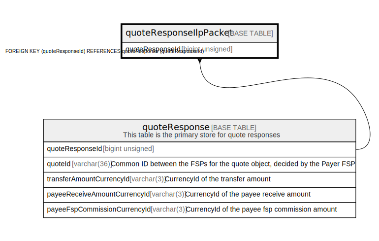

# quoteResponseIlpPacket

## Description

<details>
<summary><strong>Table Definition</strong></summary>

```sql
CREATE TABLE `quoteResponseIlpPacket` (
  `quoteResponseId` bigint unsigned NOT NULL AUTO_INCREMENT,
  `value` text NOT NULL COMMENT 'ilpPacket returned from Payee in response to a quote request',
  PRIMARY KEY (`quoteResponseId`),
  CONSTRAINT `quoteresponseilppacket_quoteresponseid_foreign` FOREIGN KEY (`quoteResponseId`) REFERENCES `quoteResponse` (`quoteResponseId`)
) ENGINE=InnoDB DEFAULT CHARSET=utf8mb4 COLLATE=utf8mb4_0900_ai_ci
```

</details>

## Columns

| Name | Type | Default | Nullable | Extra Definition | Children | Parents | Comment |
| ---- | ---- | ------- | -------- | ---------------- | -------- | ------- | ------- |
| quoteResponseId | bigint unsigned |  | false | auto_increment |  | [quoteResponse](quoteResponse.md) |  |
| value | text |  | false |  |  |  | ilpPacket returned from Payee in response to a quote request |

## Constraints

| Name | Type | Definition |
| ---- | ---- | ---------- |
| PRIMARY | PRIMARY KEY | PRIMARY KEY (quoteResponseId) |
| quoteresponseilppacket_quoteresponseid_foreign | FOREIGN KEY | FOREIGN KEY (quoteResponseId) REFERENCES quoteResponse (quoteResponseId) |

## Indexes

| Name | Definition |
| ---- | ---------- |
| PRIMARY | PRIMARY KEY (quoteResponseId) USING BTREE |

## Relations



---

> Generated by [tbls](https://github.com/k1LoW/tbls)
