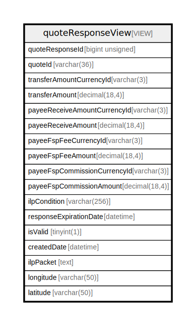

# quoteResponseView

## Description

VIEW

<details>
<summary><strong>Table Definition</strong></summary>

```sql
CREATE VIEW quoteResponseView AS (select `qr`.`quoteResponseId` AS `quoteResponseId`,`qr`.`quoteId` AS `quoteId`,`qr`.`transferAmountCurrencyId` AS `transferAmountCurrencyId`,`qr`.`transferAmount` AS `transferAmount`,`qr`.`payeeReceiveAmountCurrencyId` AS `payeeReceiveAmountCurrencyId`,`qr`.`payeeReceiveAmount` AS `payeeReceiveAmount`,`qr`.`payeeFspFeeCurrencyId` AS `payeeFspFeeCurrencyId`,`qr`.`payeeFspFeeAmount` AS `payeeFspFeeAmount`,`qr`.`payeeFspCommissionCurrencyId` AS `payeeFspCommissionCurrencyId`,`qr`.`payeeFspCommissionAmount` AS `payeeFspCommissionAmount`,`qr`.`ilpCondition` AS `ilpCondition`,`qr`.`responseExpirationDate` AS `responseExpirationDate`,`qr`.`isValid` AS `isValid`,`qr`.`createdDate` AS `createdDate`,`qrilp`.`value` AS `ilpPacket`,`gc`.`longitude` AS `longitude`,`gc`.`latitude` AS `latitude` from ((((`central_ledger`.`quoteResponse` `qr` join `central_ledger`.`quoteResponseIlpPacket` `qrilp` on((`qrilp`.`quoteResponseId` = `qr`.`quoteResponseId`))) join `central_ledger`.`quoteParty` `qp` on((`qp`.`quoteId` = `qr`.`quoteId`))) join `central_ledger`.`partyType` `pt` on((`pt`.`partyTypeId` = `qp`.`partyTypeId`))) left join `central_ledger`.`geoCode` `gc` on((`gc`.`quotePartyId` = `qp`.`quotePartyId`))) where (`pt`.`name` = 'PAYEE'))
```

</details>

## Columns

| Name                         | Type            | Default           | Nullable | Extra Definition  | Comment                                                                                                                                                       |
| ---------------------------- | --------------- | ----------------- | -------- | ----------------- | ------------------------------------------------------------------------------------------------------------------------------------------------------------- |
| quoteResponseId              | bigint unsigned | 0                 | false    |                   |                                                                                                                                                               |
| quoteId                      | varchar(36)     |                   | false    |                   | Common ID between the FSPs for the quote object, decided by the Payer FSP                                                                                     |
| transferAmountCurrencyId     | varchar(3)      |                   | false    |                   | CurrencyId of the transfer amount                                                                                                                             |
| transferAmount               | decimal(18,4)   |                   | false    |                   | The amount of money that the Payer FSP should transfer to the Payee FSP                                                                                       |
| payeeReceiveAmountCurrencyId | varchar(3)      |                   | true     |                   | CurrencyId of the payee receive amount                                                                                                                        |
| payeeReceiveAmount           | decimal(18,4)   |                   | true     |                   | The amount of Money that the Payee should receive in the end-to-end transaction. Optional as the Payee FSP might not want to disclose any optional Payee fees |
| payeeFspFeeCurrencyId        | varchar(3)      |                   | true     |                   | CurrencyId of the payee fsp fee amount                                                                                                                        |
| payeeFspFeeAmount            | decimal(18,4)   |                   | true     |                   | Payee FSP’s part of the transaction fee                                                                                                                       |
| payeeFspCommissionCurrencyId | varchar(3)      |                   | true     |                   | CurrencyId of the payee fsp commission amount                                                                                                                 |
| payeeFspCommissionAmount     | decimal(18,4)   |                   | true     |                   | Transaction commission from the Payee FSP                                                                                                                     |
| ilpCondition                 | varchar(256)    |                   | false    |                   |                                                                                                                                                               |
| responseExpirationDate       | datetime        |                   | true     |                   | Optional expiration for the requested transaction                                                                                                             |
| isValid                      | tinyint(1)      |                   | true     |                   |                                                                                                                                                               |
| createdDate                  | datetime        | CURRENT_TIMESTAMP | false    | DEFAULT_GENERATED | System dateTime stamp pertaining to the inserted record                                                                                                       |
| ilpPacket                    | text            |                   | false    |                   | ilpPacket returned from Payee in response to a quote request                                                                                                  |
| longitude                    | varchar(50)     |                   | true     |                   | Longitude of the initiating Party                                                                                                                             |
| latitude                     | varchar(50)     |                   | true     |                   | Latitude of the initiating Party                                                                                                                              |

## Referenced Tables

| Name                                                | Columns | Comment                                             | Type       |
| --------------------------------------------------- | ------- | --------------------------------------------------- | ---------- |
| [quoteResponse](quoteResponse.md)                   | 14      | This table is the primary store for quote responses | BASE TABLE |
| [quoteResponseIlpPacket](quoteResponseIlpPacket.md) | 2       |                                                     | BASE TABLE |
| [quoteParty](quoteParty.md)                         | 15      |                                                     | BASE TABLE |
| [partyType](partyType.md)                           | 3       |                                                     | BASE TABLE |
| [geoCode](geoCode.md)                               | 5       |                                                     | BASE TABLE |

## Relations



---

> Generated by [tbls](https://github.com/k1LoW/tbls)
