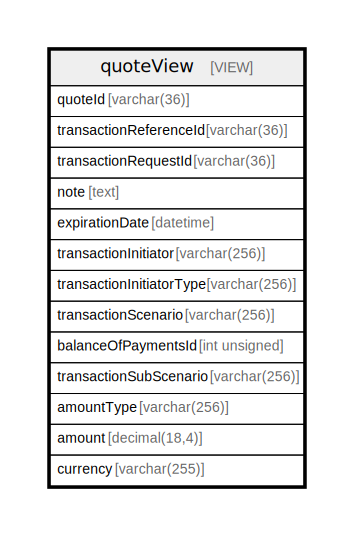

# quoteView

## Description

VIEW

<details>
<summary><strong>Table Definition</strong></summary>

```sql
CREATE VIEW quoteView AS (select `q`.`quoteId` AS `quoteId`,`q`.`transactionReferenceId` AS `transactionReferenceId`,`q`.`transactionRequestId` AS `transactionRequestId`,`q`.`note` AS `note`,`q`.`expirationDate` AS `expirationDate`,`ti`.`name` AS `transactionInitiator`,`tit`.`name` AS `transactionInitiatorType`,`ts`.`name` AS `transactionScenario`,`q`.`balanceOfPaymentsId` AS `balanceOfPaymentsId`,`tss`.`name` AS `transactionSubScenario`,`amt`.`name` AS `amountType`,`q`.`amount` AS `amount`,`q`.`currencyId` AS `currency` from (((((`central_ledger`.`quote` `q` join `central_ledger`.`transactionInitiator` `ti` on((`ti`.`transactionInitiatorId` = `q`.`transactionInitiatorId`))) join `central_ledger`.`transactionInitiatorType` `tit` on((`tit`.`transactionInitiatorTypeId` = `q`.`transactionInitiatorTypeId`))) join `central_ledger`.`transactionScenario` `ts` on((`ts`.`transactionScenarioId` = `q`.`transactionScenarioId`))) join `central_ledger`.`amountType` `amt` on((`amt`.`amountTypeId` = `q`.`amountTypeId`))) left join `central_ledger`.`transactionSubScenario` `tss` on((`tss`.`transactionSubScenarioId` = `q`.`transactionSubScenarioId`))))
```

</details>

## Columns

| Name                     | Type          | Default | Nullable | Comment                                                                                                   |
| ------------------------ | ------------- | ------- | -------- | --------------------------------------------------------------------------------------------------------- |
| quoteId                  | varchar(36)   |         | false    |                                                                                                           |
| transactionReferenceId   | varchar(36)   |         | false    | Common ID (decided by the Payer FSP) between the FSPs for the future transaction object                   |
| transactionRequestId     | varchar(36)   |         | true     | Optional previously-sent transaction request                                                              |
| note                     | text          |         | true     | A memo that will be attached to the transaction                                                           |
| expirationDate           | datetime      |         | true     | Optional expiration for the requested transaction                                                         |
| transactionInitiator     | varchar(256)  |         | false    |                                                                                                           |
| transactionInitiatorType | varchar(256)  |         | false    |                                                                                                           |
| transactionScenario      | varchar(256)  |         | false    |                                                                                                           |
| balanceOfPaymentsId      | int unsigned  |         | true     | This is part of the transaction type that contains the elements- balance of payment                       |
| transactionSubScenario   | varchar(256)  |         | true     |                                                                                                           |
| amountType               | varchar(256)  |         | false    |                                                                                                           |
| amount                   | decimal(18,4) | 0.0000  | false    | The amount that the quote is being requested for. Need to be interpert in accordance with the amount type |
| currency                 | varchar(255)  |         | true     | Trading currency pertaining to the Amount                                                                 |

## Referenced Tables

| Name                                                    | Columns | Comment | Type       |
| ------------------------------------------------------- | ------- | ------- | ---------- |
| [quote](quote.md)                                       | 14      |         | BASE TABLE |
| [transactionInitiator](transactionInitiator.md)         | 4       |         | BASE TABLE |
| [transactionInitiatorType](transactionInitiatorType.md) | 4       |         | BASE TABLE |
| [transactionScenario](transactionScenario.md)           | 4       |         | BASE TABLE |
| [amountType](amountType.md)                             | 4       |         | BASE TABLE |
| [transactionSubScenario](transactionSubScenario.md)     | 4       |         | BASE TABLE |

## Relations



---

> Generated by [tbls](https://github.com/k1LoW/tbls)
