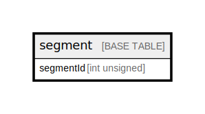

# segment

## Description

<details>
<summary><strong>Table Definition</strong></summary>

```sql
CREATE TABLE `segment` (
  `segmentId` int unsigned NOT NULL AUTO_INCREMENT,
  `segmentType` varchar(50) NOT NULL,
  `enumeration` int NOT NULL DEFAULT '0',
  `tableName` varchar(50) NOT NULL,
  `value` bigint NOT NULL,
  `changedDate` datetime NOT NULL DEFAULT CURRENT_TIMESTAMP,
  PRIMARY KEY (`segmentId`),
  KEY `segment_keys_index` (`segmentType`,`enumeration`,`tableName`)
) ENGINE=InnoDB DEFAULT CHARSET=utf8mb4 COLLATE=utf8mb4_0900_ai_ci
```

</details>

## Columns

| Name | Type | Default | Nullable | Extra Definition | Children | Parents | Comment |
| ---- | ---- | ------- | -------- | ---------------- | -------- | ------- | ------- |
| segmentId | int unsigned |  | false | auto_increment |  |  |  |
| segmentType | varchar(50) |  | false |  |  |  |  |
| enumeration | int | 0 | false |  |  |  |  |
| tableName | varchar(50) |  | false |  |  |  |  |
| value | bigint |  | false |  |  |  |  |
| changedDate | datetime | CURRENT_TIMESTAMP | false | DEFAULT_GENERATED |  |  |  |

## Constraints

| Name | Type | Definition |
| ---- | ---- | ---------- |
| PRIMARY | PRIMARY KEY | PRIMARY KEY (segmentId) |

## Indexes

| Name | Definition |
| ---- | ---------- |
| segment_keys_index | KEY segment_keys_index (segmentType, enumeration, tableName) USING BTREE |
| PRIMARY | PRIMARY KEY (segmentId) USING BTREE |

## Relations



---

> Generated by [tbls](https://github.com/k1LoW/tbls)
