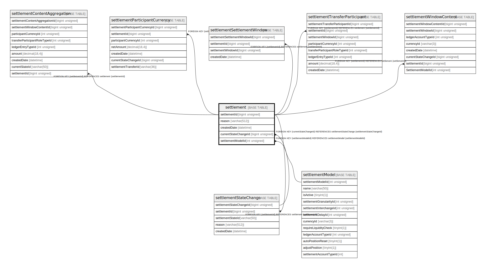

# settlement

## Description

<details>
<summary><strong>Table Definition</strong></summary>

```sql
CREATE TABLE `settlement` (
  `settlementId` bigint unsigned NOT NULL AUTO_INCREMENT,
  `reason` varchar(512) DEFAULT NULL,
  `createdDate` datetime NOT NULL DEFAULT CURRENT_TIMESTAMP,
  `currentStateChangeId` bigint unsigned DEFAULT NULL,
  `settlementModelId` int unsigned DEFAULT NULL,
  PRIMARY KEY (`settlementId`),
  KEY `settlement_currentstatechangeid_foreign` (`currentStateChangeId`),
  KEY `settlement_settlementmodelid_foreign` (`settlementModelId`),
  CONSTRAINT `settlement_currentstatechangeid_foreign` FOREIGN KEY (`currentStateChangeId`) REFERENCES `settlementStateChange` (`settlementStateChangeId`),
  CONSTRAINT `settlement_settlementmodelid_foreign` FOREIGN KEY (`settlementModelId`) REFERENCES `settlementModel` (`settlementModelId`)
) ENGINE=InnoDB DEFAULT CHARSET=utf8mb4 COLLATE=utf8mb4_0900_ai_ci
```

</details>

## Columns

| Name                 | Type            | Default           | Nullable | Extra Definition  | Children                                                                                                                                                                                                                                                                                                                                                                | Parents                                           |
| -------------------- | --------------- | ----------------- | -------- | ----------------- | ----------------------------------------------------------------------------------------------------------------------------------------------------------------------------------------------------------------------------------------------------------------------------------------------------------------------------------------------------------------------- | ------------------------------------------------- |
| settlementId         | bigint unsigned |                   | false    | auto_increment    | [settlementContentAggregation](settlementContentAggregation.md) [settlementParticipantCurrency](settlementParticipantCurrency.md) [settlementSettlementWindow](settlementSettlementWindow.md) [settlementStateChange](settlementStateChange.md) [settlementTransferParticipant](settlementTransferParticipant.md) [settlementWindowContent](settlementWindowContent.md) |                                                   |
| reason               | varchar(512)    |                   | true     |                   |                                                                                                                                                                                                                                                                                                                                                                         |                                                   |
| createdDate          | datetime        | CURRENT_TIMESTAMP | false    | DEFAULT_GENERATED |                                                                                                                                                                                                                                                                                                                                                                         |                                                   |
| currentStateChangeId | bigint unsigned |                   | true     |                   |                                                                                                                                                                                                                                                                                                                                                                         | [settlementStateChange](settlementStateChange.md) |
| settlementModelId    | int unsigned    |                   | true     |                   |                                                                                                                                                                                                                                                                                                                                                                         | [settlementModel](settlementModel.md)             |

## Constraints

| Name                                    | Type        | Definition                                                                                    |
| --------------------------------------- | ----------- | --------------------------------------------------------------------------------------------- |
| PRIMARY                                 | PRIMARY KEY | PRIMARY KEY (settlementId)                                                                    |
| settlement_currentstatechangeid_foreign | FOREIGN KEY | FOREIGN KEY (currentStateChangeId) REFERENCES settlementStateChange (settlementStateChangeId) |
| settlement_settlementmodelid_foreign    | FOREIGN KEY | FOREIGN KEY (settlementModelId) REFERENCES settlementModel (settlementModelId)                |

## Indexes

| Name                                    | Definition                                                                     |
| --------------------------------------- | ------------------------------------------------------------------------------ |
| settlement_currentstatechangeid_foreign | KEY settlement_currentstatechangeid_foreign (currentStateChangeId) USING BTREE |
| settlement_settlementmodelid_foreign    | KEY settlement_settlementmodelid_foreign (settlementModelId) USING BTREE       |
| PRIMARY                                 | PRIMARY KEY (settlementId) USING BTREE                                         |

## Relations



---

> Generated by [tbls](https://github.com/k1LoW/tbls)
