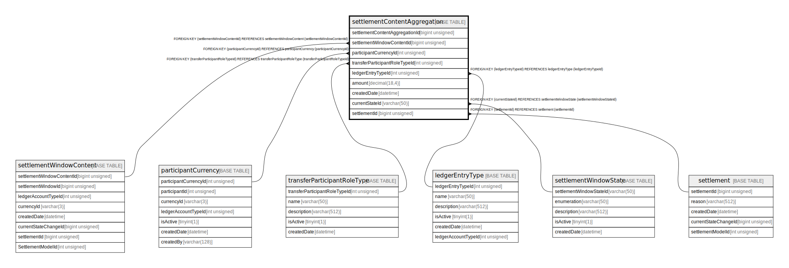

# settlementContentAggregation

## Description

<details>
<summary><strong>Table Definition</strong></summary>

```sql
CREATE TABLE `settlementContentAggregation` (
  `settlementContentAggregationId` bigint unsigned NOT NULL AUTO_INCREMENT,
  `settlementWindowContentId` bigint unsigned NOT NULL,
  `participantCurrencyId` int unsigned NOT NULL,
  `transferParticipantRoleTypeId` int unsigned NOT NULL,
  `ledgerEntryTypeId` int unsigned NOT NULL,
  `amount` decimal(18,4) NOT NULL,
  `createdDate` datetime NOT NULL DEFAULT CURRENT_TIMESTAMP,
  `currentStateId` varchar(50) NOT NULL,
  `settlementId` bigint unsigned DEFAULT NULL,
  PRIMARY KEY (`settlementContentAggregationId`),
  KEY `settlementcontentaggregation_settlementwindowcontentid_index` (`settlementWindowContentId`),
  KEY `settlementcontentaggregation_participantcurrencyid_index` (`participantCurrencyId`),
  KEY `settlementcontentaggregation_transferparticipantroletypeid_index` (`transferParticipantRoleTypeId`),
  KEY `settlementcontentaggregation_ledgerentrytypeid_index` (`ledgerEntryTypeId`),
  KEY `settlementcontentaggregation_currentstateid_index` (`currentStateId`),
  KEY `settlementcontentaggregation_settlementid_index` (`settlementId`),
  CONSTRAINT `sca_transferparticipantroletypeid_foreign` FOREIGN KEY (`transferParticipantRoleTypeId`) REFERENCES `transferParticipantRoleType` (`transferParticipantRoleTypeId`),
  CONSTRAINT `settlementcontentaggregation_currentstateid_foreign` FOREIGN KEY (`currentStateId`) REFERENCES `settlementWindowState` (`settlementWindowStateId`),
  CONSTRAINT `settlementcontentaggregation_ledgerentrytypeid_foreign` FOREIGN KEY (`ledgerEntryTypeId`) REFERENCES `ledgerEntryType` (`ledgerEntryTypeId`),
  CONSTRAINT `settlementcontentaggregation_participantcurrencyid_foreign` FOREIGN KEY (`participantCurrencyId`) REFERENCES `participantCurrency` (`participantCurrencyId`),
  CONSTRAINT `settlementcontentaggregation_settlementid_foreign` FOREIGN KEY (`settlementId`) REFERENCES `settlement` (`settlementId`),
  CONSTRAINT `settlementcontentaggregation_settlementwindowcontentid_foreign` FOREIGN KEY (`settlementWindowContentId`) REFERENCES `settlementWindowContent` (`settlementWindowContentId`)
) ENGINE=InnoDB DEFAULT CHARSET=utf8mb4 COLLATE=utf8mb4_0900_ai_ci
```

</details>

## Columns

| Name | Type | Default | Nullable | Extra Definition | Children | Parents | Comment |
| ---- | ---- | ------- | -------- | ---------------- | -------- | ------- | ------- |
| settlementContentAggregationId | bigint unsigned |  | false | auto_increment |  |  |  |
| settlementWindowContentId | bigint unsigned |  | false |  |  | [settlementWindowContent](settlementWindowContent.md) |  |
| participantCurrencyId | int unsigned |  | false |  |  | [participantCurrency](participantCurrency.md) |  |
| transferParticipantRoleTypeId | int unsigned |  | false |  |  | [transferParticipantRoleType](transferParticipantRoleType.md) |  |
| ledgerEntryTypeId | int unsigned |  | false |  |  | [ledgerEntryType](ledgerEntryType.md) |  |
| amount | decimal(18,4) |  | false |  |  |  |  |
| createdDate | datetime | CURRENT_TIMESTAMP | false | DEFAULT_GENERATED |  |  |  |
| currentStateId | varchar(50) |  | false |  |  | [settlementWindowState](settlementWindowState.md) |  |
| settlementId | bigint unsigned |  | true |  |  | [settlement](settlement.md) |  |

## Constraints

| Name | Type | Definition |
| ---- | ---- | ---------- |
| PRIMARY | PRIMARY KEY | PRIMARY KEY (settlementContentAggregationId) |
| sca_transferparticipantroletypeid_foreign | FOREIGN KEY | FOREIGN KEY (transferParticipantRoleTypeId) REFERENCES transferParticipantRoleType (transferParticipantRoleTypeId) |
| settlementcontentaggregation_currentstateid_foreign | FOREIGN KEY | FOREIGN KEY (currentStateId) REFERENCES settlementWindowState (settlementWindowStateId) |
| settlementcontentaggregation_ledgerentrytypeid_foreign | FOREIGN KEY | FOREIGN KEY (ledgerEntryTypeId) REFERENCES ledgerEntryType (ledgerEntryTypeId) |
| settlementcontentaggregation_participantcurrencyid_foreign | FOREIGN KEY | FOREIGN KEY (participantCurrencyId) REFERENCES participantCurrency (participantCurrencyId) |
| settlementcontentaggregation_settlementid_foreign | FOREIGN KEY | FOREIGN KEY (settlementId) REFERENCES settlement (settlementId) |
| settlementcontentaggregation_settlementwindowcontentid_foreign | FOREIGN KEY | FOREIGN KEY (settlementWindowContentId) REFERENCES settlementWindowContent (settlementWindowContentId) |

## Indexes

| Name | Definition |
| ---- | ---------- |
| settlementcontentaggregation_currentstateid_index | KEY settlementcontentaggregation_currentstateid_index (currentStateId) USING BTREE |
| settlementcontentaggregation_ledgerentrytypeid_index | KEY settlementcontentaggregation_ledgerentrytypeid_index (ledgerEntryTypeId) USING BTREE |
| settlementcontentaggregation_participantcurrencyid_index | KEY settlementcontentaggregation_participantcurrencyid_index (participantCurrencyId) USING BTREE |
| settlementcontentaggregation_settlementid_index | KEY settlementcontentaggregation_settlementid_index (settlementId) USING BTREE |
| settlementcontentaggregation_settlementwindowcontentid_index | KEY settlementcontentaggregation_settlementwindowcontentid_index (settlementWindowContentId) USING BTREE |
| settlementcontentaggregation_transferparticipantroletypeid_index | KEY settlementcontentaggregation_transferparticipantroletypeid_index (transferParticipantRoleTypeId) USING BTREE |
| PRIMARY | PRIMARY KEY (settlementContentAggregationId) USING BTREE |

## Relations



---

> Generated by [tbls](https://github.com/k1LoW/tbls)
