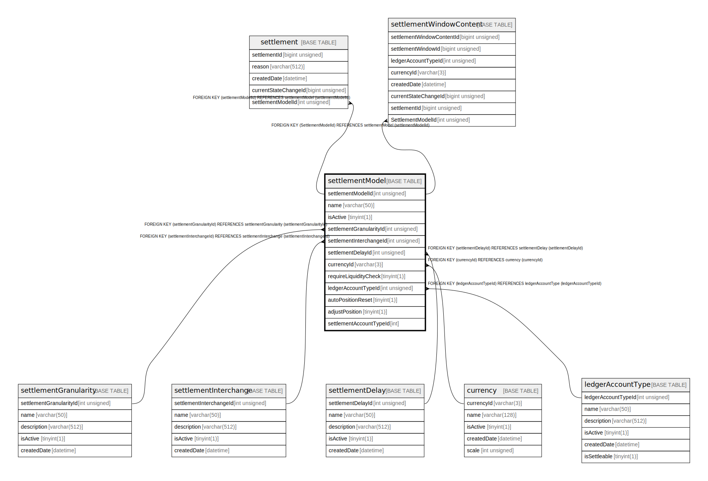

# settlementModel

## Description

<details>
<summary><strong>Table Definition</strong></summary>

```sql
CREATE TABLE `settlementModel` (
  `settlementModelId` int unsigned NOT NULL AUTO_INCREMENT,
  `name` varchar(50) NOT NULL,
  `isActive` tinyint(1) NOT NULL DEFAULT '1',
  `settlementGranularityId` int unsigned NOT NULL,
  `settlementInterchangeId` int unsigned NOT NULL,
  `settlementDelayId` int unsigned NOT NULL,
  `currencyId` varchar(3) DEFAULT NULL,
  `requireLiquidityCheck` tinyint(1) NOT NULL DEFAULT '1',
  `ledgerAccountTypeId` int unsigned NOT NULL,
  `autoPositionReset` tinyint(1) NOT NULL DEFAULT '0',
  `adjustPosition` tinyint(1) NOT NULL DEFAULT '0',
  `settlementAccountTypeId` int NOT NULL,
  PRIMARY KEY (`settlementModelId`),
  UNIQUE KEY `settlementmodel_name_unique` (`name`),
  UNIQUE KEY `settlementmodel_unique` (`settlementGranularityId`,`settlementInterchangeId`,`settlementDelayId`,`ledgerAccountTypeId`,`currencyId`),
  UNIQUE KEY `settlementmodel_uniqueAccountCurrency` (`ledgerAccountTypeId`,`currencyId`),
  UNIQUE KEY `settlementmodel_currencyid_ledgeraccounttypeid_unique` (`currencyId`,`ledgerAccountTypeId`),
  KEY `settlementmodel_settlementgranularityid_index` (`settlementGranularityId`),
  KEY `settlementmodel_settlementinterchangeid_index` (`settlementInterchangeId`),
  KEY `settlementmodel_settlementdelayid_index` (`settlementDelayId`),
  KEY `settlementmodel_currencyid_index` (`currencyId`),
  KEY `settlementmodel_ledgeraccounttypeid_index` (`ledgerAccountTypeId`),
  CONSTRAINT `settlementmodel_currencyid_foreign` FOREIGN KEY (`currencyId`) REFERENCES `currency` (`currencyId`),
  CONSTRAINT `settlementmodel_ledgeraccounttypeid_foreign` FOREIGN KEY (`ledgerAccountTypeId`) REFERENCES `ledgerAccountType` (`ledgerAccountTypeId`),
  CONSTRAINT `settlementmodel_settlementdelayid_foreign` FOREIGN KEY (`settlementDelayId`) REFERENCES `settlementDelay` (`settlementDelayId`),
  CONSTRAINT `settlementmodel_settlementgranularityid_foreign` FOREIGN KEY (`settlementGranularityId`) REFERENCES `settlementGranularity` (`settlementGranularityId`),
  CONSTRAINT `settlementmodel_settlementinterchangeid_foreign` FOREIGN KEY (`settlementInterchangeId`) REFERENCES `settlementInterchange` (`settlementInterchangeId`)
) ENGINE=InnoDB DEFAULT CHARSET=utf8mb4 COLLATE=utf8mb4_0900_ai_ci
```

</details>

## Columns

| Name                    | Type         | Default | Nullable | Extra Definition | Children                                                                          | Parents                                           |
| ----------------------- | ------------ | ------- | -------- | ---------------- | --------------------------------------------------------------------------------- | ------------------------------------------------- |
| settlementModelId       | int unsigned |         | false    | auto_increment   | [settlement](settlement.md) [settlementWindowContent](settlementWindowContent.md) |                                                   |
| name                    | varchar(50)  |         | false    |                  |                                                                                   |                                                   |
| isActive                | tinyint(1)   | 1       | false    |                  |                                                                                   |                                                   |
| settlementGranularityId | int unsigned |         | false    |                  |                                                                                   | [settlementGranularity](settlementGranularity.md) |
| settlementInterchangeId | int unsigned |         | false    |                  |                                                                                   | [settlementInterchange](settlementInterchange.md) |
| settlementDelayId       | int unsigned |         | false    |                  |                                                                                   | [settlementDelay](settlementDelay.md)             |
| currencyId              | varchar(3)   |         | true     |                  |                                                                                   | [currency](currency.md)                           |
| requireLiquidityCheck   | tinyint(1)   | 1       | false    |                  |                                                                                   |                                                   |
| ledgerAccountTypeId     | int unsigned |         | false    |                  |                                                                                   | [ledgerAccountType](ledgerAccountType.md)         |
| autoPositionReset       | tinyint(1)   | 0       | false    |                  |                                                                                   |                                                   |
| adjustPosition          | tinyint(1)   | 0       | false    |                  |                                                                                   |                                                   |
| settlementAccountTypeId | int          |         | false    |                  |                                                                                   |                                                   |

## Constraints

| Name                                                  | Type        | Definition                                                                                                                               |
| ----------------------------------------------------- | ----------- | ---------------------------------------------------------------------------------------------------------------------------------------- |
| PRIMARY                                               | PRIMARY KEY | PRIMARY KEY (settlementModelId)                                                                                                          |
| settlementmodel_currencyid_foreign                    | FOREIGN KEY | FOREIGN KEY (currencyId) REFERENCES currency (currencyId)                                                                                |
| settlementmodel_currencyid_ledgeraccounttypeid_unique | UNIQUE      | UNIQUE KEY settlementmodel_currencyid_ledgeraccounttypeid_unique (currencyId, ledgerAccountTypeId)                                       |
| settlementmodel_ledgeraccounttypeid_foreign           | FOREIGN KEY | FOREIGN KEY (ledgerAccountTypeId) REFERENCES ledgerAccountType (ledgerAccountTypeId)                                                     |
| settlementmodel_name_unique                           | UNIQUE      | UNIQUE KEY settlementmodel_name_unique (name)                                                                                            |
| settlementmodel_settlementdelayid_foreign             | FOREIGN KEY | FOREIGN KEY (settlementDelayId) REFERENCES settlementDelay (settlementDelayId)                                                           |
| settlementmodel_settlementgranularityid_foreign       | FOREIGN KEY | FOREIGN KEY (settlementGranularityId) REFERENCES settlementGranularity (settlementGranularityId)                                         |
| settlementmodel_settlementinterchangeid_foreign       | FOREIGN KEY | FOREIGN KEY (settlementInterchangeId) REFERENCES settlementInterchange (settlementInterchangeId)                                         |
| settlementmodel_unique                                | UNIQUE      | UNIQUE KEY settlementmodel_unique (settlementGranularityId, settlementInterchangeId, settlementDelayId, ledgerAccountTypeId, currencyId) |
| settlementmodel_uniqueAccountCurrency                 | UNIQUE      | UNIQUE KEY settlementmodel_uniqueAccountCurrency (ledgerAccountTypeId, currencyId)                                                       |

## Indexes

| Name                                                  | Definition                                                                                                                                           |
| ----------------------------------------------------- | ---------------------------------------------------------------------------------------------------------------------------------------------------- |
| settlementmodel_currencyid_index                      | KEY settlementmodel_currencyid_index (currencyId) USING BTREE                                                                                        |
| settlementmodel_ledgeraccounttypeid_index             | KEY settlementmodel_ledgeraccounttypeid_index (ledgerAccountTypeId) USING BTREE                                                                      |
| settlementmodel_settlementdelayid_index               | KEY settlementmodel_settlementdelayid_index (settlementDelayId) USING BTREE                                                                          |
| settlementmodel_settlementgranularityid_index         | KEY settlementmodel_settlementgranularityid_index (settlementGranularityId) USING BTREE                                                              |
| settlementmodel_settlementinterchangeid_index         | KEY settlementmodel_settlementinterchangeid_index (settlementInterchangeId) USING BTREE                                                              |
| PRIMARY                                               | PRIMARY KEY (settlementModelId) USING BTREE                                                                                                          |
| settlementmodel_currencyid_ledgeraccounttypeid_unique | UNIQUE KEY settlementmodel_currencyid_ledgeraccounttypeid_unique (currencyId, ledgerAccountTypeId) USING BTREE                                       |
| settlementmodel_name_unique                           | UNIQUE KEY settlementmodel_name_unique (name) USING BTREE                                                                                            |
| settlementmodel_unique                                | UNIQUE KEY settlementmodel_unique (settlementGranularityId, settlementInterchangeId, settlementDelayId, ledgerAccountTypeId, currencyId) USING BTREE |
| settlementmodel_uniqueAccountCurrency                 | UNIQUE KEY settlementmodel_uniqueAccountCurrency (ledgerAccountTypeId, currencyId) USING BTREE                                                       |

## Relations



---

> Generated by [tbls](https://github.com/k1LoW/tbls)
