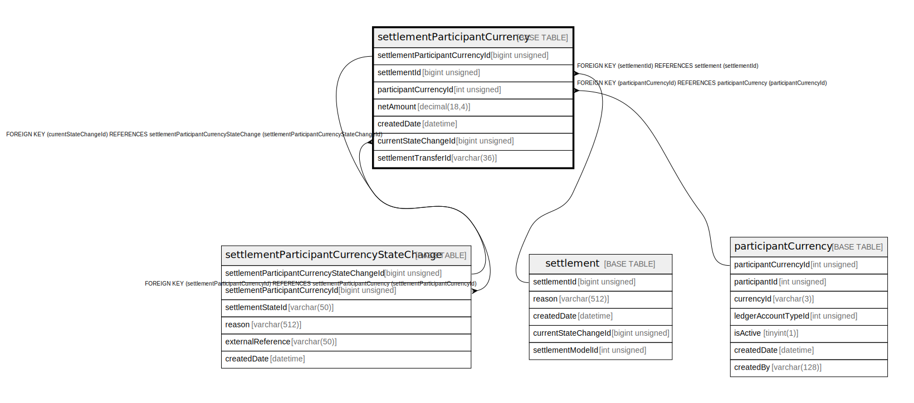

# settlementParticipantCurrency

## Description

<details>
<summary><strong>Table Definition</strong></summary>

```sql
CREATE TABLE `settlementParticipantCurrency` (
  `settlementParticipantCurrencyId` bigint unsigned NOT NULL AUTO_INCREMENT,
  `settlementId` bigint unsigned NOT NULL,
  `participantCurrencyId` int unsigned NOT NULL,
  `netAmount` decimal(18,4) NOT NULL,
  `createdDate` datetime NOT NULL DEFAULT CURRENT_TIMESTAMP,
  `currentStateChangeId` bigint unsigned DEFAULT NULL,
  `settlementTransferId` varchar(36) DEFAULT NULL,
  PRIMARY KEY (`settlementParticipantCurrencyId`),
  KEY `settlementparticipantcurrency_settlementid_index` (`settlementId`),
  KEY `settlementparticipantcurrency_participantcurrencyid_index` (`participantCurrencyId`),
  KEY `settlementparticipantcurrency_settlementtransferid_index` (`settlementTransferId`),
  KEY `spc_currentstatechangeid_foreign` (`currentStateChangeId`),
  CONSTRAINT `settlementparticipantcurrency_participantcurrencyid_foreign` FOREIGN KEY (`participantCurrencyId`) REFERENCES `participantCurrency` (`participantCurrencyId`),
  CONSTRAINT `settlementparticipantcurrency_settlementid_foreign` FOREIGN KEY (`settlementId`) REFERENCES `settlement` (`settlementId`),
  CONSTRAINT `spc_currentstatechangeid_foreign` FOREIGN KEY (`currentStateChangeId`) REFERENCES `settlementParticipantCurrencyStateChange` (`settlementParticipantCurrencyStateChangeId`)
) ENGINE=InnoDB DEFAULT CHARSET=utf8mb4 COLLATE=utf8mb4_0900_ai_ci
```

</details>

## Columns

| Name                            | Type            | Default           | Nullable | Extra Definition  | Children                                                                                | Parents                                                                                 |
| ------------------------------- | --------------- | ----------------- | -------- | ----------------- | --------------------------------------------------------------------------------------- | --------------------------------------------------------------------------------------- |
| settlementParticipantCurrencyId | bigint unsigned |                   | false    | auto_increment    | [settlementParticipantCurrencyStateChange](settlementParticipantCurrencyStateChange.md) |                                                                                         |
| settlementId                    | bigint unsigned |                   | false    |                   |                                                                                         | [settlement](settlement.md)                                                             |
| participantCurrencyId           | int unsigned    |                   | false    |                   |                                                                                         | [participantCurrency](participantCurrency.md)                                           |
| netAmount                       | decimal(18,4)   |                   | false    |                   |                                                                                         |                                                                                         |
| createdDate                     | datetime        | CURRENT_TIMESTAMP | false    | DEFAULT_GENERATED |                                                                                         |                                                                                         |
| currentStateChangeId            | bigint unsigned |                   | true     |                   |                                                                                         | [settlementParticipantCurrencyStateChange](settlementParticipantCurrencyStateChange.md) |
| settlementTransferId            | varchar(36)     |                   | true     |                   |                                                                                         |                                                                                         |

## Constraints

| Name                                                        | Type        | Definition                                                                                                                          |
| ----------------------------------------------------------- | ----------- | ----------------------------------------------------------------------------------------------------------------------------------- |
| PRIMARY                                                     | PRIMARY KEY | PRIMARY KEY (settlementParticipantCurrencyId)                                                                                       |
| settlementparticipantcurrency_participantcurrencyid_foreign | FOREIGN KEY | FOREIGN KEY (participantCurrencyId) REFERENCES participantCurrency (participantCurrencyId)                                          |
| settlementparticipantcurrency_settlementid_foreign          | FOREIGN KEY | FOREIGN KEY (settlementId) REFERENCES settlement (settlementId)                                                                     |
| spc_currentstatechangeid_foreign                            | FOREIGN KEY | FOREIGN KEY (currentStateChangeId) REFERENCES settlementParticipantCurrencyStateChange (settlementParticipantCurrencyStateChangeId) |

## Indexes

| Name                                                      | Definition                                                                                        |
| --------------------------------------------------------- | ------------------------------------------------------------------------------------------------- |
| settlementparticipantcurrency_participantcurrencyid_index | KEY settlementparticipantcurrency_participantcurrencyid_index (participantCurrencyId) USING BTREE |
| settlementparticipantcurrency_settlementid_index          | KEY settlementparticipantcurrency_settlementid_index (settlementId) USING BTREE                   |
| settlementparticipantcurrency_settlementtransferid_index  | KEY settlementparticipantcurrency_settlementtransferid_index (settlementTransferId) USING BTREE   |
| spc_currentstatechangeid_foreign                          | KEY spc_currentstatechangeid_foreign (currentStateChangeId) USING BTREE                           |
| PRIMARY                                                   | PRIMARY KEY (settlementParticipantCurrencyId) USING BTREE                                         |

## Relations



---

> Generated by [tbls](https://github.com/k1LoW/tbls)
