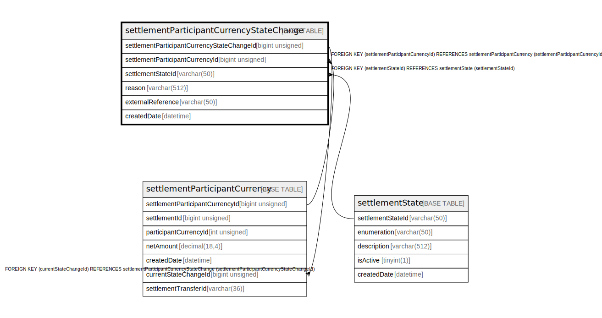

# settlementParticipantCurrencyStateChange

## Description

<details>
<summary><strong>Table Definition</strong></summary>

```sql
CREATE TABLE `settlementParticipantCurrencyStateChange` (
  `settlementParticipantCurrencyStateChangeId` bigint unsigned NOT NULL AUTO_INCREMENT,
  `settlementParticipantCurrencyId` bigint unsigned NOT NULL,
  `settlementStateId` varchar(50) NOT NULL,
  `reason` varchar(512) DEFAULT NULL,
  `externalReference` varchar(50) DEFAULT NULL,
  `createdDate` datetime NOT NULL DEFAULT CURRENT_TIMESTAMP,
  PRIMARY KEY (`settlementParticipantCurrencyStateChangeId`),
  KEY `spcsc_settlementparticipantcurrencyid_index` (`settlementParticipantCurrencyId`),
  KEY `spcsc_settlementstateid_index` (`settlementStateId`),
  CONSTRAINT `spcsc_settlementparticipantcurrencyid_foreign` FOREIGN KEY (`settlementParticipantCurrencyId`) REFERENCES `settlementParticipantCurrency` (`settlementParticipantCurrencyId`),
  CONSTRAINT `spcsc_settlementstateid_foreign` FOREIGN KEY (`settlementStateId`) REFERENCES `settlementState` (`settlementStateId`)
) ENGINE=InnoDB DEFAULT CHARSET=utf8mb4 COLLATE=utf8mb4_0900_ai_ci
```

</details>

## Columns

| Name | Type | Default | Nullable | Extra Definition | Children | Parents | Comment |
| ---- | ---- | ------- | -------- | ---------------- | -------- | ------- | ------- |
| settlementParticipantCurrencyStateChangeId | bigint unsigned |  | false | auto_increment | [settlementParticipantCurrency](settlementParticipantCurrency.md) |  |  |
| settlementParticipantCurrencyId | bigint unsigned |  | false |  |  | [settlementParticipantCurrency](settlementParticipantCurrency.md) |  |
| settlementStateId | varchar(50) |  | false |  |  | [settlementState](settlementState.md) |  |
| reason | varchar(512) |  | true |  |  |  |  |
| externalReference | varchar(50) |  | true |  |  |  |  |
| createdDate | datetime | CURRENT_TIMESTAMP | false | DEFAULT_GENERATED |  |  |  |

## Constraints

| Name | Type | Definition |
| ---- | ---- | ---------- |
| PRIMARY | PRIMARY KEY | PRIMARY KEY (settlementParticipantCurrencyStateChangeId) |
| spcsc_settlementparticipantcurrencyid_foreign | FOREIGN KEY | FOREIGN KEY (settlementParticipantCurrencyId) REFERENCES settlementParticipantCurrency (settlementParticipantCurrencyId) |
| spcsc_settlementstateid_foreign | FOREIGN KEY | FOREIGN KEY (settlementStateId) REFERENCES settlementState (settlementStateId) |

## Indexes

| Name | Definition |
| ---- | ---------- |
| spcsc_settlementparticipantcurrencyid_index | KEY spcsc_settlementparticipantcurrencyid_index (settlementParticipantCurrencyId) USING BTREE |
| spcsc_settlementstateid_index | KEY spcsc_settlementstateid_index (settlementStateId) USING BTREE |
| PRIMARY | PRIMARY KEY (settlementParticipantCurrencyStateChangeId) USING BTREE |

## Relations



---

> Generated by [tbls](https://github.com/k1LoW/tbls)
