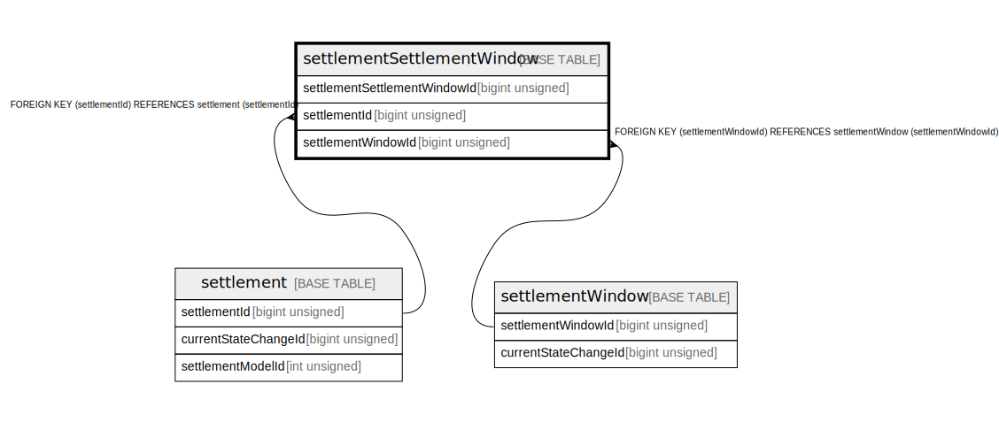

# settlementSettlementWindow

## Description

<details>
<summary><strong>Table Definition</strong></summary>

```sql
CREATE TABLE `settlementSettlementWindow` (
  `settlementSettlementWindowId` bigint unsigned NOT NULL AUTO_INCREMENT,
  `settlementId` bigint unsigned NOT NULL,
  `settlementWindowId` bigint unsigned NOT NULL,
  `createdDate` datetime NOT NULL DEFAULT CURRENT_TIMESTAMP,
  PRIMARY KEY (`settlementSettlementWindowId`),
  UNIQUE KEY `settlementsettlementwindow_unique` (`settlementId`,`settlementWindowId`),
  KEY `settlementsettlementwindow_settlementid_index` (`settlementId`),
  KEY `settlementsettlementwindow_settlementwindowid_index` (`settlementWindowId`),
  CONSTRAINT `settlementsettlementwindow_settlementid_foreign` FOREIGN KEY (`settlementId`) REFERENCES `settlement` (`settlementId`),
  CONSTRAINT `settlementsettlementwindow_settlementwindowid_foreign` FOREIGN KEY (`settlementWindowId`) REFERENCES `settlementWindow` (`settlementWindowId`)
) ENGINE=InnoDB DEFAULT CHARSET=utf8mb4 COLLATE=utf8mb4_0900_ai_ci
```

</details>

## Columns

| Name                         | Type            | Default           | Nullable | Extra Definition  | Parents                                 |
| ---------------------------- | --------------- | ----------------- | -------- | ----------------- | --------------------------------------- |
| settlementSettlementWindowId | bigint unsigned |                   | false    | auto_increment    |                                         |
| settlementId                 | bigint unsigned |                   | false    |                   | [settlement](settlement.md)             |
| settlementWindowId           | bigint unsigned |                   | false    |                   | [settlementWindow](settlementWindow.md) |
| createdDate                  | datetime        | CURRENT_TIMESTAMP | false    | DEFAULT_GENERATED |                                         |

## Constraints

| Name                                                  | Type        | Definition                                                                        |
| ----------------------------------------------------- | ----------- | --------------------------------------------------------------------------------- |
| PRIMARY                                               | PRIMARY KEY | PRIMARY KEY (settlementSettlementWindowId)                                        |
| settlementsettlementwindow_settlementid_foreign       | FOREIGN KEY | FOREIGN KEY (settlementId) REFERENCES settlement (settlementId)                   |
| settlementsettlementwindow_settlementwindowid_foreign | FOREIGN KEY | FOREIGN KEY (settlementWindowId) REFERENCES settlementWindow (settlementWindowId) |
| settlementsettlementwindow_unique                     | UNIQUE      | UNIQUE KEY settlementsettlementwindow_unique (settlementId, settlementWindowId)   |

## Indexes

| Name                                                | Definition                                                                                  |
| --------------------------------------------------- | ------------------------------------------------------------------------------------------- |
| settlementsettlementwindow_settlementid_index       | KEY settlementsettlementwindow_settlementid_index (settlementId) USING BTREE                |
| settlementsettlementwindow_settlementwindowid_index | KEY settlementsettlementwindow_settlementwindowid_index (settlementWindowId) USING BTREE    |
| PRIMARY                                             | PRIMARY KEY (settlementSettlementWindowId) USING BTREE                                      |
| settlementsettlementwindow_unique                   | UNIQUE KEY settlementsettlementwindow_unique (settlementId, settlementWindowId) USING BTREE |

## Relations



---

> Generated by [tbls](https://github.com/k1LoW/tbls)
