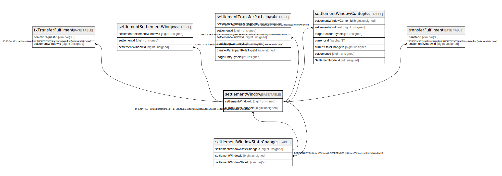

# settlementWindow

## Description

<details>
<summary><strong>Table Definition</strong></summary>

```sql
CREATE TABLE `settlementWindow` (
  `settlementWindowId` bigint unsigned NOT NULL AUTO_INCREMENT,
  `reason` varchar(512) DEFAULT NULL,
  `createdDate` datetime NOT NULL DEFAULT CURRENT_TIMESTAMP,
  `currentStateChangeId` bigint unsigned DEFAULT NULL,
  PRIMARY KEY (`settlementWindowId`),
  KEY `settlementwindow_currentstatechangeid_foreign` (`currentStateChangeId`),
  CONSTRAINT `settlementwindow_currentstatechangeid_foreign` FOREIGN KEY (`currentStateChangeId`) REFERENCES `settlementWindowStateChange` (`settlementWindowStateChangeId`)
) ENGINE=InnoDB AUTO_INCREMENT=[Redacted by tbls] DEFAULT CHARSET=utf8mb4 COLLATE=utf8mb4_0900_ai_ci
```

</details>

## Columns

| Name                 | Type            | Default           | Nullable | Extra Definition  | Children                                                                                                                                                                                                                                                                                                                                      | Parents                                                       |
| -------------------- | --------------- | ----------------- | -------- | ----------------- | --------------------------------------------------------------------------------------------------------------------------------------------------------------------------------------------------------------------------------------------------------------------------------------------------------------------------------------------- | ------------------------------------------------------------- |
| settlementWindowId   | bigint unsigned |                   | false    | auto_increment    | [fxTransferFulfilment](fxTransferFulfilment.md) [settlementSettlementWindow](settlementSettlementWindow.md) [settlementTransferParticipant](settlementTransferParticipant.md) [settlementWindowContent](settlementWindowContent.md) [settlementWindowStateChange](settlementWindowStateChange.md) [transferFulfilment](transferFulfilment.md) |                                                               |
| reason               | varchar(512)    |                   | true     |                   |                                                                                                                                                                                                                                                                                                                                               |                                                               |
| createdDate          | datetime        | CURRENT_TIMESTAMP | false    | DEFAULT_GENERATED |                                                                                                                                                                                                                                                                                                                                               |                                                               |
| currentStateChangeId | bigint unsigned |                   | true     |                   |                                                                                                                                                                                                                                                                                                                                               | [settlementWindowStateChange](settlementWindowStateChange.md) |

## Constraints

| Name                                          | Type        | Definition                                                                                                |
| --------------------------------------------- | ----------- | --------------------------------------------------------------------------------------------------------- |
| PRIMARY                                       | PRIMARY KEY | PRIMARY KEY (settlementWindowId)                                                                          |
| settlementwindow_currentstatechangeid_foreign | FOREIGN KEY | FOREIGN KEY (currentStateChangeId) REFERENCES settlementWindowStateChange (settlementWindowStateChangeId) |

## Indexes

| Name                                          | Definition                                                                           |
| --------------------------------------------- | ------------------------------------------------------------------------------------ |
| settlementwindow_currentstatechangeid_foreign | KEY settlementwindow_currentstatechangeid_foreign (currentStateChangeId) USING BTREE |
| PRIMARY                                       | PRIMARY KEY (settlementWindowId) USING BTREE                                         |

## Relations



---

> Generated by [tbls](https://github.com/k1LoW/tbls)
