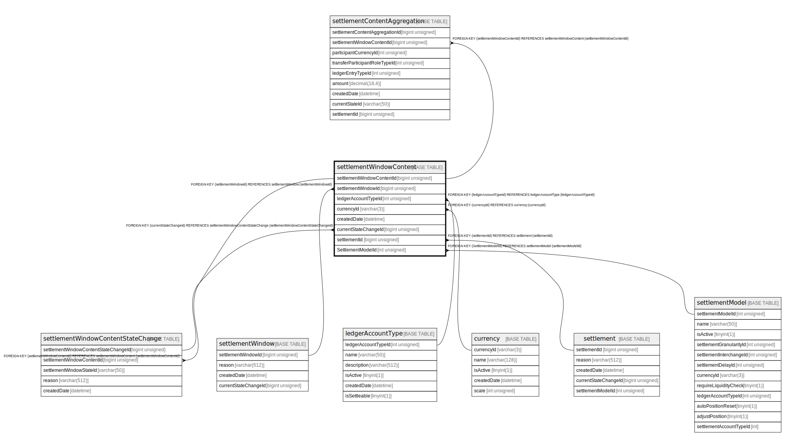

# settlementWindowContent

## Description

<details>
<summary><strong>Table Definition</strong></summary>

```sql
CREATE TABLE `settlementWindowContent` (
  `settlementWindowContentId` bigint unsigned NOT NULL AUTO_INCREMENT,
  `settlementWindowId` bigint unsigned NOT NULL,
  `ledgerAccountTypeId` int unsigned NOT NULL,
  `currencyId` varchar(3) NOT NULL,
  `createdDate` datetime NOT NULL DEFAULT CURRENT_TIMESTAMP,
  `currentStateChangeId` bigint unsigned DEFAULT NULL,
  `settlementId` bigint unsigned DEFAULT NULL,
  `SettlementModelId` int unsigned DEFAULT NULL,
  PRIMARY KEY (`settlementWindowContentId`),
  KEY `settlementwindowcontent_settlementwindowid_index` (`settlementWindowId`),
  KEY `settlementwindowcontent_ledgeraccounttypeid_index` (`ledgerAccountTypeId`),
  KEY `settlementwindowcontent_currencyid_index` (`currencyId`),
  KEY `settlementwindowcontent_currentstatechangeid_index` (`currentStateChangeId`),
  KEY `settlementwindowcontent_settlementid_index` (`settlementId`),
  KEY `settlementwindowcontent_settlementmodelid_foreign` (`SettlementModelId`),
  CONSTRAINT `settlementwindowcontent_currencyid_foreign` FOREIGN KEY (`currencyId`) REFERENCES `currency` (`currencyId`),
  CONSTRAINT `settlementwindowcontent_currentstatechangeid_foreign` FOREIGN KEY (`currentStateChangeId`) REFERENCES `settlementWindowContentStateChange` (`settlementWindowContentStateChangeId`),
  CONSTRAINT `settlementwindowcontent_ledgeraccounttypeid_foreign` FOREIGN KEY (`ledgerAccountTypeId`) REFERENCES `ledgerAccountType` (`ledgerAccountTypeId`),
  CONSTRAINT `settlementwindowcontent_settlementid_foreign` FOREIGN KEY (`settlementId`) REFERENCES `settlement` (`settlementId`),
  CONSTRAINT `settlementwindowcontent_settlementmodelid_foreign` FOREIGN KEY (`SettlementModelId`) REFERENCES `settlementModel` (`settlementModelId`),
  CONSTRAINT `settlementwindowcontent_settlementwindowid_foreign` FOREIGN KEY (`settlementWindowId`) REFERENCES `settlementWindow` (`settlementWindowId`)
) ENGINE=InnoDB DEFAULT CHARSET=utf8mb4 COLLATE=utf8mb4_0900_ai_ci
```

</details>

## Columns

| Name | Type | Default | Nullable | Extra Definition | Children | Parents | Comment |
| ---- | ---- | ------- | -------- | ---------------- | -------- | ------- | ------- |
| settlementWindowContentId | bigint unsigned |  | false | auto_increment | [settlementContentAggregation](settlementContentAggregation.md) [settlementWindowContentStateChange](settlementWindowContentStateChange.md) |  |  |
| settlementWindowId | bigint unsigned |  | false |  |  | [settlementWindow](settlementWindow.md) |  |
| ledgerAccountTypeId | int unsigned |  | false |  |  | [ledgerAccountType](ledgerAccountType.md) |  |
| currencyId | varchar(3) |  | false |  |  | [currency](currency.md) |  |
| createdDate | datetime | CURRENT_TIMESTAMP | false | DEFAULT_GENERATED |  |  |  |
| currentStateChangeId | bigint unsigned |  | true |  |  | [settlementWindowContentStateChange](settlementWindowContentStateChange.md) |  |
| settlementId | bigint unsigned |  | true |  |  | [settlement](settlement.md) |  |
| SettlementModelId | int unsigned |  | true |  |  | [settlementModel](settlementModel.md) |  |

## Constraints

| Name | Type | Definition |
| ---- | ---- | ---------- |
| PRIMARY | PRIMARY KEY | PRIMARY KEY (settlementWindowContentId) |
| settlementwindowcontent_currencyid_foreign | FOREIGN KEY | FOREIGN KEY (currencyId) REFERENCES currency (currencyId) |
| settlementwindowcontent_currentstatechangeid_foreign | FOREIGN KEY | FOREIGN KEY (currentStateChangeId) REFERENCES settlementWindowContentStateChange (settlementWindowContentStateChangeId) |
| settlementwindowcontent_ledgeraccounttypeid_foreign | FOREIGN KEY | FOREIGN KEY (ledgerAccountTypeId) REFERENCES ledgerAccountType (ledgerAccountTypeId) |
| settlementwindowcontent_settlementid_foreign | FOREIGN KEY | FOREIGN KEY (settlementId) REFERENCES settlement (settlementId) |
| settlementwindowcontent_settlementmodelid_foreign | FOREIGN KEY | FOREIGN KEY (SettlementModelId) REFERENCES settlementModel (settlementModelId) |
| settlementwindowcontent_settlementwindowid_foreign | FOREIGN KEY | FOREIGN KEY (settlementWindowId) REFERENCES settlementWindow (settlementWindowId) |

## Indexes

| Name | Definition |
| ---- | ---------- |
| settlementwindowcontent_currencyid_index | KEY settlementwindowcontent_currencyid_index (currencyId) USING BTREE |
| settlementwindowcontent_currentstatechangeid_index | KEY settlementwindowcontent_currentstatechangeid_index (currentStateChangeId) USING BTREE |
| settlementwindowcontent_ledgeraccounttypeid_index | KEY settlementwindowcontent_ledgeraccounttypeid_index (ledgerAccountTypeId) USING BTREE |
| settlementwindowcontent_settlementid_index | KEY settlementwindowcontent_settlementid_index (settlementId) USING BTREE |
| settlementwindowcontent_settlementmodelid_foreign | KEY settlementwindowcontent_settlementmodelid_foreign (SettlementModelId) USING BTREE |
| settlementwindowcontent_settlementwindowid_index | KEY settlementwindowcontent_settlementwindowid_index (settlementWindowId) USING BTREE |
| PRIMARY | PRIMARY KEY (settlementWindowContentId) USING BTREE |

## Relations



---

> Generated by [tbls](https://github.com/k1LoW/tbls)
