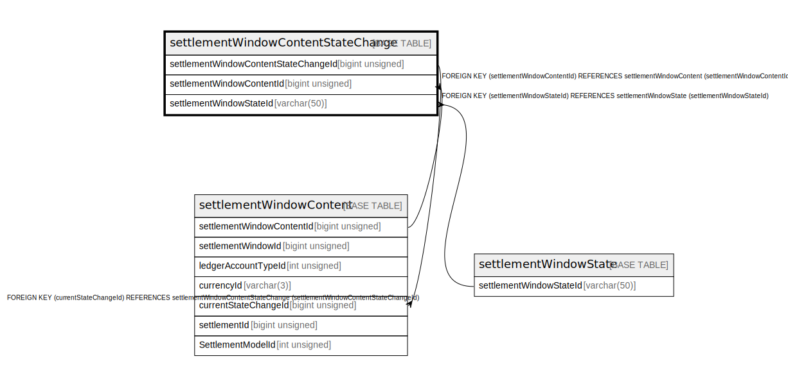

# settlementWindowContentStateChange

## Description

<details>
<summary><strong>Table Definition</strong></summary>

```sql
CREATE TABLE `settlementWindowContentStateChange` (
  `settlementWindowContentStateChangeId` bigint unsigned NOT NULL AUTO_INCREMENT,
  `settlementWindowContentId` bigint unsigned NOT NULL,
  `settlementWindowStateId` varchar(50) NOT NULL,
  `reason` varchar(512) DEFAULT NULL,
  `createdDate` datetime NOT NULL DEFAULT CURRENT_TIMESTAMP,
  PRIMARY KEY (`settlementWindowContentStateChangeId`),
  KEY `swcsc_settlementwindowcontentid_index` (`settlementWindowContentId`),
  KEY `swcsc_settlementwindowstateid_index` (`settlementWindowStateId`),
  CONSTRAINT `swc_settlementwindowcontentid_foreign` FOREIGN KEY (`settlementWindowContentId`) REFERENCES `settlementWindowContent` (`settlementWindowContentId`),
  CONSTRAINT `sws1_settlementwindowstateid_foreign` FOREIGN KEY (`settlementWindowStateId`) REFERENCES `settlementWindowState` (`settlementWindowStateId`)
) ENGINE=InnoDB DEFAULT CHARSET=utf8mb4 COLLATE=utf8mb4_0900_ai_ci
```

</details>

## Columns

| Name                                 | Type            | Default           | Nullable | Extra Definition  | Children                                              | Parents                                               |
| ------------------------------------ | --------------- | ----------------- | -------- | ----------------- | ----------------------------------------------------- | ----------------------------------------------------- |
| settlementWindowContentStateChangeId | bigint unsigned |                   | false    | auto_increment    | [settlementWindowContent](settlementWindowContent.md) |                                                       |
| settlementWindowContentId            | bigint unsigned |                   | false    |                   |                                                       | [settlementWindowContent](settlementWindowContent.md) |
| settlementWindowStateId              | varchar(50)     |                   | false    |                   |                                                       | [settlementWindowState](settlementWindowState.md)     |
| reason                               | varchar(512)    |                   | true     |                   |                                                       |                                                       |
| createdDate                          | datetime        | CURRENT_TIMESTAMP | false    | DEFAULT_GENERATED |                                                       |                                                       |

## Constraints

| Name                                  | Type        | Definition                                                                                             |
| ------------------------------------- | ----------- | ------------------------------------------------------------------------------------------------------ |
| PRIMARY                               | PRIMARY KEY | PRIMARY KEY (settlementWindowContentStateChangeId)                                                     |
| swc_settlementwindowcontentid_foreign | FOREIGN KEY | FOREIGN KEY (settlementWindowContentId) REFERENCES settlementWindowContent (settlementWindowContentId) |
| sws1_settlementwindowstateid_foreign  | FOREIGN KEY | FOREIGN KEY (settlementWindowStateId) REFERENCES settlementWindowState (settlementWindowStateId)       |

## Indexes

| Name                                  | Definition                                                                        |
| ------------------------------------- | --------------------------------------------------------------------------------- |
| swcsc_settlementwindowcontentid_index | KEY swcsc_settlementwindowcontentid_index (settlementWindowContentId) USING BTREE |
| swcsc_settlementwindowstateid_index   | KEY swcsc_settlementwindowstateid_index (settlementWindowStateId) USING BTREE     |
| PRIMARY                               | PRIMARY KEY (settlementWindowContentStateChangeId) USING BTREE                    |

## Relations



---

> Generated by [tbls](https://github.com/k1LoW/tbls)
