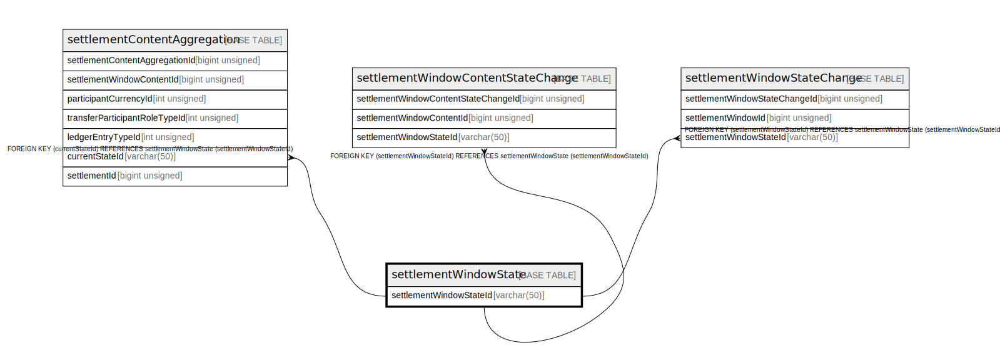

# settlementWindowState

## Description

<details>
<summary><strong>Table Definition</strong></summary>

```sql
CREATE TABLE `settlementWindowState` (
  `settlementWindowStateId` varchar(50) NOT NULL,
  `enumeration` varchar(50) NOT NULL,
  `description` varchar(512) DEFAULT NULL,
  `isActive` tinyint(1) NOT NULL DEFAULT '1',
  `createdDate` datetime NOT NULL DEFAULT CURRENT_TIMESTAMP,
  PRIMARY KEY (`settlementWindowStateId`)
) ENGINE=InnoDB DEFAULT CHARSET=utf8mb4 COLLATE=utf8mb4_0900_ai_ci
```

</details>

## Columns

| Name                    | Type         | Default           | Nullable | Extra Definition  | Children                                                                                                                                                                                                  |
| ----------------------- | ------------ | ----------------- | -------- | ----------------- | --------------------------------------------------------------------------------------------------------------------------------------------------------------------------------------------------------- |
| settlementWindowStateId | varchar(50)  |                   | false    |                   | [settlementContentAggregation](settlementContentAggregation.md) [settlementWindowContentStateChange](settlementWindowContentStateChange.md) [settlementWindowStateChange](settlementWindowStateChange.md) |
| enumeration             | varchar(50)  |                   | false    |                   |                                                                                                                                                                                                           |
| description             | varchar(512) |                   | true     |                   |                                                                                                                                                                                                           |
| isActive                | tinyint(1)   | 1                 | false    |                   |                                                                                                                                                                                                           |
| createdDate             | datetime     | CURRENT_TIMESTAMP | false    | DEFAULT_GENERATED |                                                                                                                                                                                                           |

## Constraints

| Name    | Type        | Definition                            |
| ------- | ----------- | ------------------------------------- |
| PRIMARY | PRIMARY KEY | PRIMARY KEY (settlementWindowStateId) |

## Indexes

| Name    | Definition                                        |
| ------- | ------------------------------------------------- |
| PRIMARY | PRIMARY KEY (settlementWindowStateId) USING BTREE |

## Relations



---

> Generated by [tbls](https://github.com/k1LoW/tbls)
