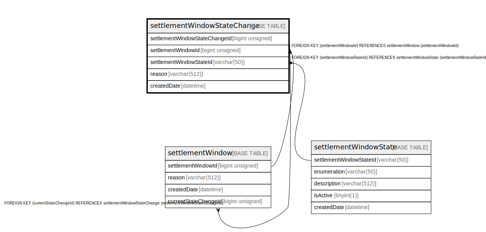

# settlementWindowStateChange

## Description

<details>
<summary><strong>Table Definition</strong></summary>

```sql
CREATE TABLE `settlementWindowStateChange` (
  `settlementWindowStateChangeId` bigint unsigned NOT NULL AUTO_INCREMENT,
  `settlementWindowId` bigint unsigned NOT NULL,
  `settlementWindowStateId` varchar(50) NOT NULL,
  `reason` varchar(512) DEFAULT NULL,
  `createdDate` datetime NOT NULL DEFAULT CURRENT_TIMESTAMP,
  PRIMARY KEY (`settlementWindowStateChangeId`),
  KEY `settlementwindowstatechange_settlementwindowid_index` (`settlementWindowId`),
  KEY `settlementwindowstatechange_settlementwindowstateid_index` (`settlementWindowStateId`),
  CONSTRAINT `settlementwindowstatechange_settlementwindowid_foreign` FOREIGN KEY (`settlementWindowId`) REFERENCES `settlementWindow` (`settlementWindowId`),
  CONSTRAINT `settlementwindowstatechange_settlementwindowstateid_foreign` FOREIGN KEY (`settlementWindowStateId`) REFERENCES `settlementWindowState` (`settlementWindowStateId`)
) ENGINE=InnoDB AUTO_INCREMENT=[Redacted by tbls] DEFAULT CHARSET=utf8mb4 COLLATE=utf8mb4_0900_ai_ci
```

</details>

## Columns

| Name | Type | Default | Nullable | Extra Definition | Children | Parents | Comment |
| ---- | ---- | ------- | -------- | ---------------- | -------- | ------- | ------- |
| settlementWindowStateChangeId | bigint unsigned |  | false | auto_increment | [settlementWindow](settlementWindow.md) |  |  |
| settlementWindowId | bigint unsigned |  | false |  |  | [settlementWindow](settlementWindow.md) |  |
| settlementWindowStateId | varchar(50) |  | false |  |  | [settlementWindowState](settlementWindowState.md) |  |
| reason | varchar(512) |  | true |  |  |  |  |
| createdDate | datetime | CURRENT_TIMESTAMP | false | DEFAULT_GENERATED |  |  |  |

## Constraints

| Name | Type | Definition |
| ---- | ---- | ---------- |
| PRIMARY | PRIMARY KEY | PRIMARY KEY (settlementWindowStateChangeId) |
| settlementwindowstatechange_settlementwindowid_foreign | FOREIGN KEY | FOREIGN KEY (settlementWindowId) REFERENCES settlementWindow (settlementWindowId) |
| settlementwindowstatechange_settlementwindowstateid_foreign | FOREIGN KEY | FOREIGN KEY (settlementWindowStateId) REFERENCES settlementWindowState (settlementWindowStateId) |

## Indexes

| Name | Definition |
| ---- | ---------- |
| settlementwindowstatechange_settlementwindowid_index | KEY settlementwindowstatechange_settlementwindowid_index (settlementWindowId) USING BTREE |
| settlementwindowstatechange_settlementwindowstateid_index | KEY settlementwindowstatechange_settlementwindowstateid_index (settlementWindowStateId) USING BTREE |
| PRIMARY | PRIMARY KEY (settlementWindowStateChangeId) USING BTREE |

## Relations



---

> Generated by [tbls](https://github.com/k1LoW/tbls)
