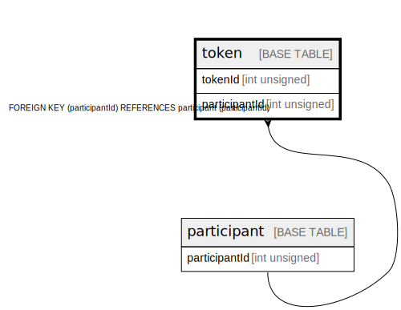

# token

## Description

<details>
<summary><strong>Table Definition</strong></summary>

```sql
CREATE TABLE `token` (
  `tokenId` int unsigned NOT NULL AUTO_INCREMENT,
  `participantId` int unsigned NOT NULL,
  `value` varchar(256) NOT NULL,
  `expiration` bigint DEFAULT NULL,
  `createdDate` datetime NOT NULL DEFAULT CURRENT_TIMESTAMP,
  PRIMARY KEY (`tokenId`),
  UNIQUE KEY `token_value_unique` (`value`),
  KEY `token_participantid_index` (`participantId`),
  CONSTRAINT `token_participantid_foreign` FOREIGN KEY (`participantId`) REFERENCES `participant` (`participantId`)
) ENGINE=InnoDB DEFAULT CHARSET=utf8mb4 COLLATE=utf8mb4_0900_ai_ci
```

</details>

## Columns

| Name          | Type         | Default           | Nullable | Extra Definition  | Parents                       |
| ------------- | ------------ | ----------------- | -------- | ----------------- | ----------------------------- |
| tokenId       | int unsigned |                   | false    | auto_increment    |                               |
| participantId | int unsigned |                   | false    |                   | [participant](participant.md) |
| value         | varchar(256) |                   | false    |                   |                               |
| expiration    | bigint       |                   | true     |                   |                               |
| createdDate   | datetime     | CURRENT_TIMESTAMP | false    | DEFAULT_GENERATED |                               |

## Constraints

| Name                        | Type        | Definition                                                         |
| --------------------------- | ----------- | ------------------------------------------------------------------ |
| PRIMARY                     | PRIMARY KEY | PRIMARY KEY (tokenId)                                              |
| token_participantid_foreign | FOREIGN KEY | FOREIGN KEY (participantId) REFERENCES participant (participantId) |
| token_value_unique          | UNIQUE      | UNIQUE KEY token_value_unique (value)                              |

## Indexes

| Name                      | Definition                                                |
| ------------------------- | --------------------------------------------------------- |
| token_participantid_index | KEY token_participantid_index (participantId) USING BTREE |
| PRIMARY                   | PRIMARY KEY (tokenId) USING BTREE                         |
| token_value_unique        | UNIQUE KEY token_value_unique (value) USING BTREE         |

## Relations



---

> Generated by [tbls](https://github.com/k1LoW/tbls)
