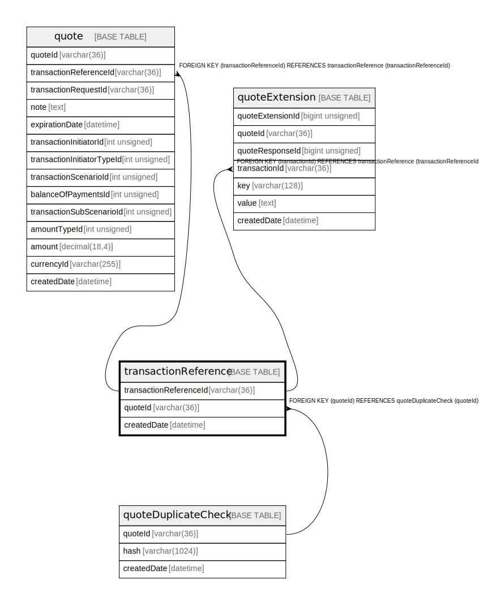

# transactionReference

## Description

<details>
<summary><strong>Table Definition</strong></summary>

```sql
CREATE TABLE `transactionReference` (
  `transactionReferenceId` varchar(36) NOT NULL COMMENT 'Common ID (decided by the Payer FSP) between the FSPs for the future transaction object',
  `quoteId` varchar(36) DEFAULT NULL COMMENT 'Common ID between the FSPs for the quote object, decided by the Payer FSP',
  `createdDate` datetime NOT NULL DEFAULT CURRENT_TIMESTAMP COMMENT 'System row creation timestamp',
  PRIMARY KEY (`transactionReferenceId`),
  KEY `transactionreference_quoteid_index` (`quoteId`),
  CONSTRAINT `transactionreference_quoteid_foreign` FOREIGN KEY (`quoteId`) REFERENCES `quoteDuplicateCheck` (`quoteId`)
) ENGINE=InnoDB DEFAULT CHARSET=utf8mb4 COLLATE=utf8mb4_0900_ai_ci
```

</details>

## Columns

| Name                   | Type        | Default           | Nullable | Extra Definition  | Children                                              | Parents                                       | Comment                                                                                 |
| ---------------------- | ----------- | ----------------- | -------- | ----------------- | ----------------------------------------------------- | --------------------------------------------- | --------------------------------------------------------------------------------------- |
| transactionReferenceId | varchar(36) |                   | false    |                   | [quote](quote.md) [quoteExtension](quoteExtension.md) |                                               | Common ID (decided by the Payer FSP) between the FSPs for the future transaction object |
| quoteId                | varchar(36) |                   | true     |                   |                                                       | [quoteDuplicateCheck](quoteDuplicateCheck.md) | Common ID between the FSPs for the quote object, decided by the Payer FSP               |
| createdDate            | datetime    | CURRENT_TIMESTAMP | false    | DEFAULT_GENERATED |                                                       |                                               | System row creation timestamp                                                           |

## Constraints

| Name                                 | Type        | Definition                                                     |
| ------------------------------------ | ----------- | -------------------------------------------------------------- |
| PRIMARY                              | PRIMARY KEY | PRIMARY KEY (transactionReferenceId)                           |
| transactionreference_quoteid_foreign | FOREIGN KEY | FOREIGN KEY (quoteId) REFERENCES quoteDuplicateCheck (quoteId) |

## Indexes

| Name                               | Definition                                                   |
| ---------------------------------- | ------------------------------------------------------------ |
| transactionreference_quoteid_index | KEY transactionreference_quoteid_index (quoteId) USING BTREE |
| PRIMARY                            | PRIMARY KEY (transactionReferenceId) USING BTREE             |

## Relations



---

> Generated by [tbls](https://github.com/k1LoW/tbls)
