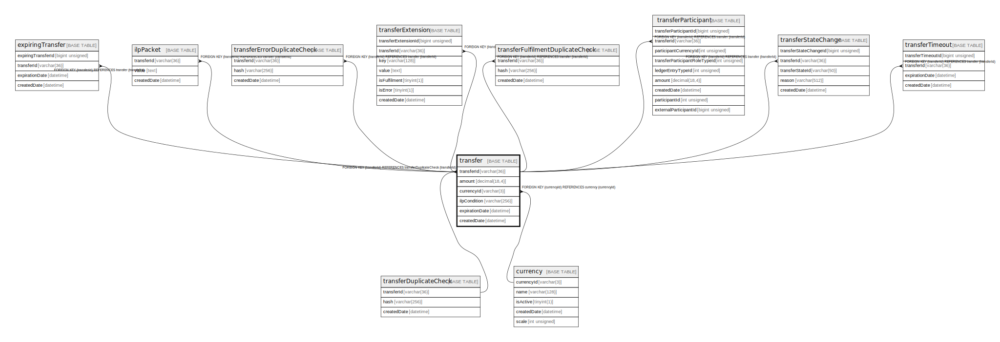

# transfer

## Description

<details>
<summary><strong>Table Definition</strong></summary>

```sql
CREATE TABLE `transfer` (
  `transferId` varchar(36) NOT NULL,
  `amount` decimal(18,4) NOT NULL,
  `currencyId` varchar(3) NOT NULL,
  `ilpCondition` varchar(256) NOT NULL,
  `expirationDate` datetime NOT NULL,
  `createdDate` datetime NOT NULL DEFAULT CURRENT_TIMESTAMP,
  PRIMARY KEY (`transferId`),
  KEY `transfer_currencyid_index` (`currencyId`),
  CONSTRAINT `transfer_currencyid_foreign` FOREIGN KEY (`currencyId`) REFERENCES `currency` (`currencyId`),
  CONSTRAINT `transfer_transferid_foreign` FOREIGN KEY (`transferId`) REFERENCES `transferDuplicateCheck` (`transferId`)
) ENGINE=InnoDB DEFAULT CHARSET=utf8mb4 COLLATE=utf8mb4_0900_ai_ci
```

</details>

## Columns

| Name | Type | Default | Nullable | Extra Definition | Children | Parents | Comment |
| ---- | ---- | ------- | -------- | ---------------- | -------- | ------- | ------- |
| transferId | varchar(36) |  | false |  | [expiringTransfer](expiringTransfer.md) [ilpPacket](ilpPacket.md) [transferErrorDuplicateCheck](transferErrorDuplicateCheck.md) [transferExtension](transferExtension.md) [transferFulfilmentDuplicateCheck](transferFulfilmentDuplicateCheck.md) [transferParticipant](transferParticipant.md) [transferStateChange](transferStateChange.md) [transferTimeout](transferTimeout.md) | [transferDuplicateCheck](transferDuplicateCheck.md) |  |
| amount | decimal(18,4) |  | false |  |  |  |  |
| currencyId | varchar(3) |  | false |  |  | [currency](currency.md) |  |
| ilpCondition | varchar(256) |  | false |  |  |  |  |
| expirationDate | datetime |  | false |  |  |  |  |
| createdDate | datetime | CURRENT_TIMESTAMP | false | DEFAULT_GENERATED |  |  |  |

## Constraints

| Name | Type | Definition |
| ---- | ---- | ---------- |
| PRIMARY | PRIMARY KEY | PRIMARY KEY (transferId) |
| transfer_currencyid_foreign | FOREIGN KEY | FOREIGN KEY (currencyId) REFERENCES currency (currencyId) |
| transfer_transferid_foreign | FOREIGN KEY | FOREIGN KEY (transferId) REFERENCES transferDuplicateCheck (transferId) |

## Indexes

| Name | Definition |
| ---- | ---------- |
| transfer_currencyid_index | KEY transfer_currencyid_index (currencyId) USING BTREE |
| PRIMARY | PRIMARY KEY (transferId) USING BTREE |

## Relations



---

> Generated by [tbls](https://github.com/k1LoW/tbls)
