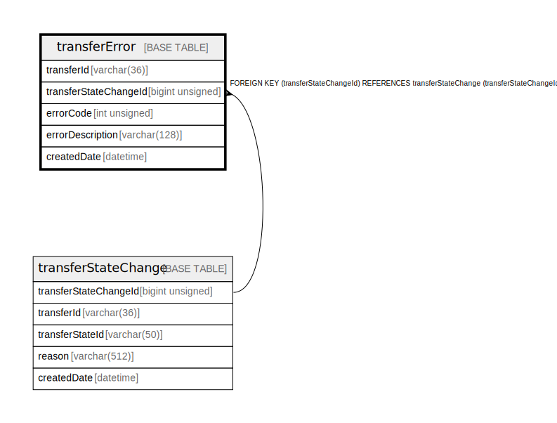

# transferError

## Description

<details>
<summary><strong>Table Definition</strong></summary>

```sql
CREATE TABLE `transferError` (
  `transferId` varchar(36) NOT NULL,
  `transferStateChangeId` bigint unsigned NOT NULL,
  `errorCode` int unsigned NOT NULL,
  `errorDescription` varchar(128) NOT NULL,
  `createdDate` datetime NOT NULL DEFAULT CURRENT_TIMESTAMP,
  PRIMARY KEY (`transferId`),
  KEY `transfererror_transferstatechangeid_foreign` (`transferStateChangeId`),
  CONSTRAINT `transfererror_transferstatechangeid_foreign` FOREIGN KEY (`transferStateChangeId`) REFERENCES `transferStateChange` (`transferStateChangeId`)
) ENGINE=InnoDB DEFAULT CHARSET=utf8mb4 COLLATE=utf8mb4_0900_ai_ci
```

</details>

## Columns

| Name                  | Type            | Default           | Nullable | Extra Definition  | Parents                                       |
| --------------------- | --------------- | ----------------- | -------- | ----------------- | --------------------------------------------- |
| transferId            | varchar(36)     |                   | false    |                   |                                               |
| transferStateChangeId | bigint unsigned |                   | false    |                   | [transferStateChange](transferStateChange.md) |
| errorCode             | int unsigned    |                   | false    |                   |                                               |
| errorDescription      | varchar(128)    |                   | false    |                   |                                               |
| createdDate           | datetime        | CURRENT_TIMESTAMP | false    | DEFAULT_GENERATED |                                               |

## Constraints

| Name                                        | Type        | Definition                                                                                 |
| ------------------------------------------- | ----------- | ------------------------------------------------------------------------------------------ |
| PRIMARY                                     | PRIMARY KEY | PRIMARY KEY (transferId)                                                                   |
| transfererror_transferstatechangeid_foreign | FOREIGN KEY | FOREIGN KEY (transferStateChangeId) REFERENCES transferStateChange (transferStateChangeId) |

## Indexes

| Name                                        | Definition                                                                          |
| ------------------------------------------- | ----------------------------------------------------------------------------------- |
| transfererror_transferstatechangeid_foreign | KEY transfererror_transferstatechangeid_foreign (transferStateChangeId) USING BTREE |
| PRIMARY                                     | PRIMARY KEY (transferId) USING BTREE                                                |

## Relations



---

> Generated by [tbls](https://github.com/k1LoW/tbls)
