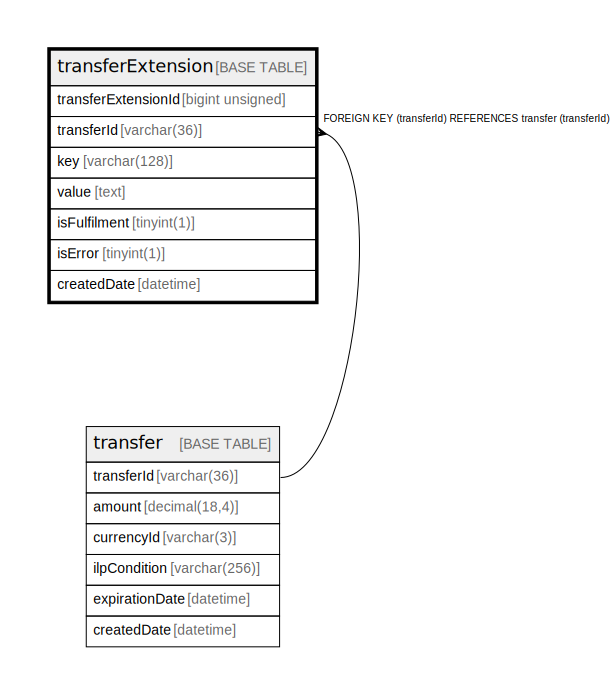

# transferExtension

## Description

<details>
<summary><strong>Table Definition</strong></summary>

```sql
CREATE TABLE `transferExtension` (
  `transferExtensionId` bigint unsigned NOT NULL AUTO_INCREMENT,
  `transferId` varchar(36) NOT NULL,
  `key` varchar(128) NOT NULL,
  `value` text NOT NULL,
  `isFulfilment` tinyint(1) NOT NULL DEFAULT '0',
  `isError` tinyint(1) NOT NULL DEFAULT '0',
  `createdDate` datetime NOT NULL DEFAULT CURRENT_TIMESTAMP,
  PRIMARY KEY (`transferExtensionId`),
  KEY `transferextension_transferid_foreign` (`transferId`),
  CONSTRAINT `transferextension_transferid_foreign` FOREIGN KEY (`transferId`) REFERENCES `transfer` (`transferId`)
) ENGINE=InnoDB DEFAULT CHARSET=utf8mb4 COLLATE=utf8mb4_0900_ai_ci
```

</details>

## Columns

| Name                | Type            | Default           | Nullable | Extra Definition  | Parents                 |
| ------------------- | --------------- | ----------------- | -------- | ----------------- | ----------------------- |
| transferExtensionId | bigint unsigned |                   | false    | auto_increment    |                         |
| transferId          | varchar(36)     |                   | false    |                   | [transfer](transfer.md) |
| key                 | varchar(128)    |                   | false    |                   |                         |
| value               | text            |                   | false    |                   |                         |
| isFulfilment        | tinyint(1)      | 0                 | false    |                   |                         |
| isError             | tinyint(1)      | 0                 | false    |                   |                         |
| createdDate         | datetime        | CURRENT_TIMESTAMP | false    | DEFAULT_GENERATED |                         |

## Constraints

| Name                                 | Type        | Definition                                                |
| ------------------------------------ | ----------- | --------------------------------------------------------- |
| PRIMARY                              | PRIMARY KEY | PRIMARY KEY (transferExtensionId)                         |
| transferextension_transferid_foreign | FOREIGN KEY | FOREIGN KEY (transferId) REFERENCES transfer (transferId) |

## Indexes

| Name                                 | Definition                                                        |
| ------------------------------------ | ----------------------------------------------------------------- |
| transferextension_transferid_foreign | KEY transferextension_transferid_foreign (transferId) USING BTREE |
| PRIMARY                              | PRIMARY KEY (transferExtensionId) USING BTREE                     |

## Relations



---

> Generated by [tbls](https://github.com/k1LoW/tbls)
