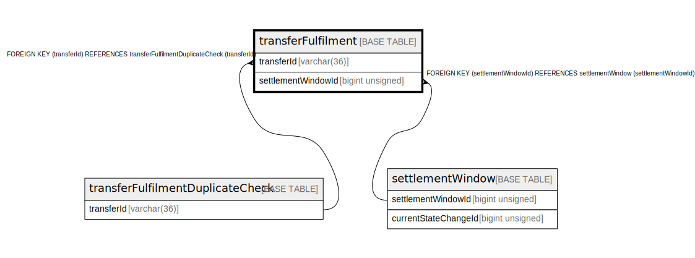

# transferFulfilment

## Description

<details>
<summary><strong>Table Definition</strong></summary>

```sql
CREATE TABLE `transferFulfilment` (
  `transferId` varchar(36) NOT NULL,
  `ilpFulfilment` varchar(256) DEFAULT NULL,
  `completedDate` datetime NOT NULL,
  `isValid` tinyint(1) DEFAULT NULL,
  `settlementWindowId` bigint unsigned DEFAULT NULL,
  `createdDate` datetime NOT NULL DEFAULT CURRENT_TIMESTAMP,
  PRIMARY KEY (`transferId`),
  KEY `transferfulfilment_settlementwindowid_foreign` (`settlementWindowId`),
  CONSTRAINT `transferfulfilment_settlementwindowid_foreign` FOREIGN KEY (`settlementWindowId`) REFERENCES `settlementWindow` (`settlementWindowId`),
  CONSTRAINT `transferfulfilment_transferid_foreign` FOREIGN KEY (`transferId`) REFERENCES `transferFulfilmentDuplicateCheck` (`transferId`)
) ENGINE=InnoDB DEFAULT CHARSET=utf8mb4 COLLATE=utf8mb4_0900_ai_ci
```

</details>

## Columns

| Name               | Type            | Default           | Nullable | Extra Definition  | Parents                                                                 |
| ------------------ | --------------- | ----------------- | -------- | ----------------- | ----------------------------------------------------------------------- |
| transferId         | varchar(36)     |                   | false    |                   | [transferFulfilmentDuplicateCheck](transferFulfilmentDuplicateCheck.md) |
| ilpFulfilment      | varchar(256)    |                   | true     |                   |                                                                         |
| completedDate      | datetime        |                   | false    |                   |                                                                         |
| isValid            | tinyint(1)      |                   | true     |                   |                                                                         |
| settlementWindowId | bigint unsigned |                   | true     |                   | [settlementWindow](settlementWindow.md)                                 |
| createdDate        | datetime        | CURRENT_TIMESTAMP | false    | DEFAULT_GENERATED |                                                                         |

## Constraints

| Name                                          | Type        | Definition                                                                        |
| --------------------------------------------- | ----------- | --------------------------------------------------------------------------------- |
| PRIMARY                                       | PRIMARY KEY | PRIMARY KEY (transferId)                                                          |
| transferfulfilment_settlementwindowid_foreign | FOREIGN KEY | FOREIGN KEY (settlementWindowId) REFERENCES settlementWindow (settlementWindowId) |
| transferfulfilment_transferid_foreign         | FOREIGN KEY | FOREIGN KEY (transferId) REFERENCES transferFulfilmentDuplicateCheck (transferId) |

## Indexes

| Name                                          | Definition                                                                         |
| --------------------------------------------- | ---------------------------------------------------------------------------------- |
| transferfulfilment_settlementwindowid_foreign | KEY transferfulfilment_settlementwindowid_foreign (settlementWindowId) USING BTREE |
| PRIMARY                                       | PRIMARY KEY (transferId) USING BTREE                                               |

## Relations



---

> Generated by [tbls](https://github.com/k1LoW/tbls)
