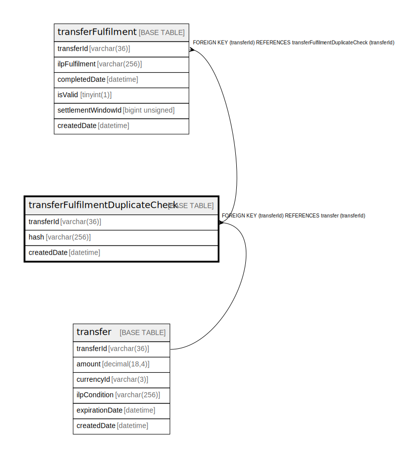

# transferFulfilmentDuplicateCheck

## Description

<details>
<summary><strong>Table Definition</strong></summary>

```sql
CREATE TABLE `transferFulfilmentDuplicateCheck` (
  `transferId` varchar(36) NOT NULL,
  `hash` varchar(256) DEFAULT NULL,
  `createdDate` datetime NOT NULL DEFAULT CURRENT_TIMESTAMP,
  PRIMARY KEY (`transferId`),
  CONSTRAINT `transferfulfilmentduplicatecheck_transferid_foreign` FOREIGN KEY (`transferId`) REFERENCES `transfer` (`transferId`)
) ENGINE=InnoDB DEFAULT CHARSET=utf8mb4 COLLATE=utf8mb4_0900_ai_ci
```

</details>

## Columns

| Name | Type | Default | Nullable | Extra Definition | Children | Parents | Comment |
| ---- | ---- | ------- | -------- | ---------------- | -------- | ------- | ------- |
| transferId | varchar(36) |  | false |  | [transferFulfilment](transferFulfilment.md) | [transfer](transfer.md) |  |
| hash | varchar(256) |  | true |  |  |  |  |
| createdDate | datetime | CURRENT_TIMESTAMP | false | DEFAULT_GENERATED |  |  |  |

## Constraints

| Name | Type | Definition |
| ---- | ---- | ---------- |
| PRIMARY | PRIMARY KEY | PRIMARY KEY (transferId) |
| transferfulfilmentduplicatecheck_transferid_foreign | FOREIGN KEY | FOREIGN KEY (transferId) REFERENCES transfer (transferId) |

## Indexes

| Name | Definition |
| ---- | ---------- |
| PRIMARY | PRIMARY KEY (transferId) USING BTREE |

## Relations



---

> Generated by [tbls](https://github.com/k1LoW/tbls)
