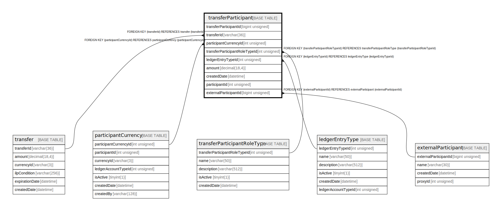

# transferParticipant

## Description

<details>
<summary><strong>Table Definition</strong></summary>

```sql
CREATE TABLE `transferParticipant` (
  `transferParticipantId` bigint unsigned NOT NULL AUTO_INCREMENT,
  `transferId` varchar(36) NOT NULL,
  `participantCurrencyId` int unsigned DEFAULT NULL,
  `transferParticipantRoleTypeId` int unsigned NOT NULL,
  `ledgerEntryTypeId` int unsigned NOT NULL,
  `amount` decimal(18,4) NOT NULL,
  `createdDate` datetime NOT NULL DEFAULT CURRENT_TIMESTAMP,
  `participantId` int unsigned NOT NULL,
  `externalParticipantId` bigint unsigned DEFAULT NULL,
  PRIMARY KEY (`transferParticipantId`),
  KEY `transferparticipant_transferid_index` (`transferId`),
  KEY `transferparticipant_participantcurrencyid_index` (`participantCurrencyId`),
  KEY `transferparticipant_transferparticipantroletypeid_index` (`transferParticipantRoleTypeId`),
  KEY `transferparticipant_ledgerentrytypeid_index` (`ledgerEntryTypeId`),
  KEY `getTransferInfoToChangePosition` (`transferId`,`transferParticipantRoleTypeId`,`ledgerEntryTypeId`),
  KEY `transferparticipant_participantid_index` (`participantId`),
  KEY `transferparticipant_externalparticipantid_index` (`externalParticipantId`),
  CONSTRAINT `transferparticipant_externalparticipantid_foreign` FOREIGN KEY (`externalParticipantId`) REFERENCES `externalParticipant` (`externalParticipantId`),
  CONSTRAINT `transferparticipant_ledgerentrytypeid_foreign` FOREIGN KEY (`ledgerEntryTypeId`) REFERENCES `ledgerEntryType` (`ledgerEntryTypeId`),
  CONSTRAINT `transferparticipant_participantcurrencyid_foreign` FOREIGN KEY (`participantCurrencyId`) REFERENCES `participantCurrency` (`participantCurrencyId`),
  CONSTRAINT `transferparticipant_transferid_foreign` FOREIGN KEY (`transferId`) REFERENCES `transfer` (`transferId`),
  CONSTRAINT `transferparticipant_transferparticipantroletypeid_foreign` FOREIGN KEY (`transferParticipantRoleTypeId`) REFERENCES `transferParticipantRoleType` (`transferParticipantRoleTypeId`)
) ENGINE=InnoDB DEFAULT CHARSET=utf8mb4 COLLATE=utf8mb4_0900_ai_ci
```

</details>

## Columns

| Name | Type | Default | Nullable | Extra Definition | Children | Parents | Comment |
| ---- | ---- | ------- | -------- | ---------------- | -------- | ------- | ------- |
| transferParticipantId | bigint unsigned |  | false | auto_increment |  |  |  |
| transferId | varchar(36) |  | false |  |  | [transfer](transfer.md) |  |
| participantCurrencyId | int unsigned |  | true |  |  | [participantCurrency](participantCurrency.md) |  |
| transferParticipantRoleTypeId | int unsigned |  | false |  |  | [transferParticipantRoleType](transferParticipantRoleType.md) |  |
| ledgerEntryTypeId | int unsigned |  | false |  |  | [ledgerEntryType](ledgerEntryType.md) |  |
| amount | decimal(18,4) |  | false |  |  |  |  |
| createdDate | datetime | CURRENT_TIMESTAMP | false | DEFAULT_GENERATED |  |  |  |
| participantId | int unsigned |  | false |  |  |  |  |
| externalParticipantId | bigint unsigned |  | true |  |  | [externalParticipant](externalParticipant.md) |  |

## Constraints

| Name | Type | Definition |
| ---- | ---- | ---------- |
| PRIMARY | PRIMARY KEY | PRIMARY KEY (transferParticipantId) |
| transferparticipant_externalparticipantid_foreign | FOREIGN KEY | FOREIGN KEY (externalParticipantId) REFERENCES externalParticipant (externalParticipantId) |
| transferparticipant_ledgerentrytypeid_foreign | FOREIGN KEY | FOREIGN KEY (ledgerEntryTypeId) REFERENCES ledgerEntryType (ledgerEntryTypeId) |
| transferparticipant_participantcurrencyid_foreign | FOREIGN KEY | FOREIGN KEY (participantCurrencyId) REFERENCES participantCurrency (participantCurrencyId) |
| transferparticipant_transferid_foreign | FOREIGN KEY | FOREIGN KEY (transferId) REFERENCES transfer (transferId) |
| transferparticipant_transferparticipantroletypeid_foreign | FOREIGN KEY | FOREIGN KEY (transferParticipantRoleTypeId) REFERENCES transferParticipantRoleType (transferParticipantRoleTypeId) |

## Indexes

| Name | Definition |
| ---- | ---------- |
| getTransferInfoToChangePosition | KEY getTransferInfoToChangePosition (transferId, transferParticipantRoleTypeId, ledgerEntryTypeId) USING BTREE |
| transferparticipant_externalparticipantid_index | KEY transferparticipant_externalparticipantid_index (externalParticipantId) USING BTREE |
| transferparticipant_ledgerentrytypeid_index | KEY transferparticipant_ledgerentrytypeid_index (ledgerEntryTypeId) USING BTREE |
| transferparticipant_participantcurrencyid_index | KEY transferparticipant_participantcurrencyid_index (participantCurrencyId) USING BTREE |
| transferparticipant_participantid_index | KEY transferparticipant_participantid_index (participantId) USING BTREE |
| transferparticipant_transferid_index | KEY transferparticipant_transferid_index (transferId) USING BTREE |
| transferparticipant_transferparticipantroletypeid_index | KEY transferparticipant_transferparticipantroletypeid_index (transferParticipantRoleTypeId) USING BTREE |
| PRIMARY | PRIMARY KEY (transferParticipantId) USING BTREE |

## Relations



---

> Generated by [tbls](https://github.com/k1LoW/tbls)
