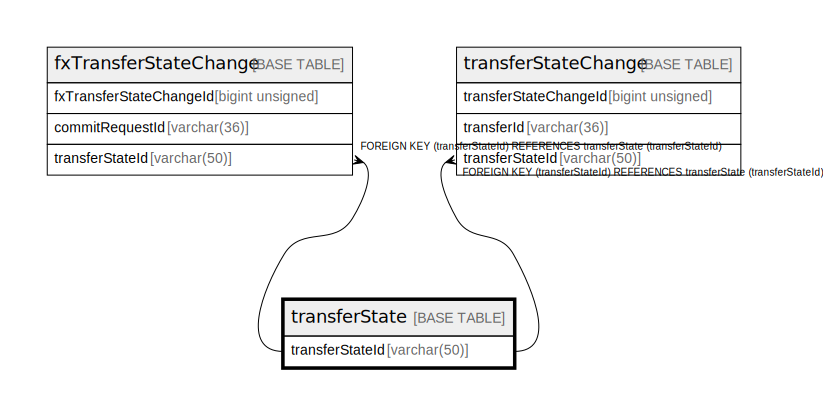

# transferState

## Description

<details>
<summary><strong>Table Definition</strong></summary>

```sql
CREATE TABLE `transferState` (
  `transferStateId` varchar(50) NOT NULL,
  `enumeration` varchar(50) NOT NULL COMMENT 'transferState associated to the Mojaloop API',
  `description` varchar(512) DEFAULT NULL,
  `isActive` tinyint(1) NOT NULL DEFAULT '1',
  `createdDate` datetime NOT NULL DEFAULT CURRENT_TIMESTAMP,
  PRIMARY KEY (`transferStateId`)
) ENGINE=InnoDB DEFAULT CHARSET=utf8mb4 COLLATE=utf8mb4_0900_ai_ci
```

</details>

## Columns

| Name | Type | Default | Nullable | Extra Definition | Children | Parents | Comment |
| ---- | ---- | ------- | -------- | ---------------- | -------- | ------- | ------- |
| transferStateId | varchar(50) |  | false |  | [fxTransferStateChange](fxTransferStateChange.md) [transferStateChange](transferStateChange.md) |  |  |
| enumeration | varchar(50) |  | false |  |  |  | transferState associated to the Mojaloop API |
| description | varchar(512) |  | true |  |  |  |  |
| isActive | tinyint(1) | 1 | false |  |  |  |  |
| createdDate | datetime | CURRENT_TIMESTAMP | false | DEFAULT_GENERATED |  |  |  |

## Constraints

| Name | Type | Definition |
| ---- | ---- | ---------- |
| PRIMARY | PRIMARY KEY | PRIMARY KEY (transferStateId) |

## Indexes

| Name | Definition |
| ---- | ---------- |
| PRIMARY | PRIMARY KEY (transferStateId) USING BTREE |

## Relations



---

> Generated by [tbls](https://github.com/k1LoW/tbls)
