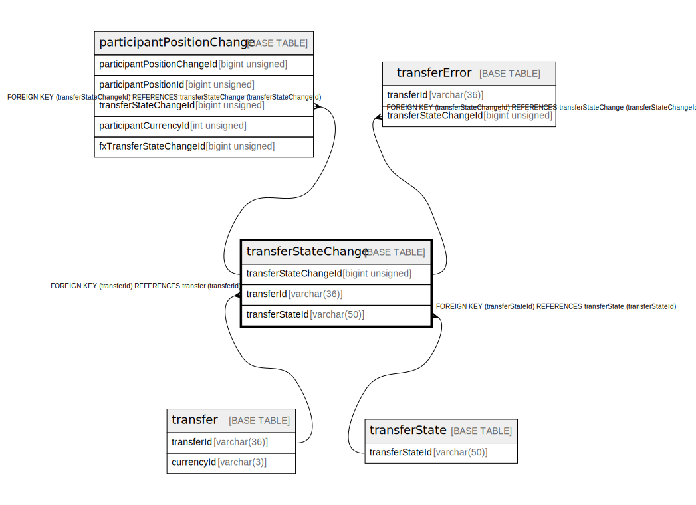

# transferStateChange

## Description

<details>
<summary><strong>Table Definition</strong></summary>

```sql
CREATE TABLE `transferStateChange` (
  `transferStateChangeId` bigint unsigned NOT NULL AUTO_INCREMENT,
  `transferId` varchar(36) NOT NULL,
  `transferStateId` varchar(50) NOT NULL,
  `reason` varchar(512) DEFAULT NULL,
  `createdDate` datetime NOT NULL DEFAULT CURRENT_TIMESTAMP,
  PRIMARY KEY (`transferStateChangeId`),
  KEY `transferstatechange_transferid_index` (`transferId`),
  KEY `transferstatechange_transferstateid_index` (`transferStateId`),
  CONSTRAINT `transferstatechange_transferid_foreign` FOREIGN KEY (`transferId`) REFERENCES `transfer` (`transferId`),
  CONSTRAINT `transferstatechange_transferstateid_foreign` FOREIGN KEY (`transferStateId`) REFERENCES `transferState` (`transferStateId`)
) ENGINE=InnoDB DEFAULT CHARSET=utf8mb4 COLLATE=utf8mb4_0900_ai_ci
```

</details>

## Columns

| Name | Type | Default | Nullable | Extra Definition | Children | Parents | Comment |
| ---- | ---- | ------- | -------- | ---------------- | -------- | ------- | ------- |
| transferStateChangeId | bigint unsigned |  | false | auto_increment | [participantPositionChange](participantPositionChange.md) [transferError](transferError.md) |  |  |
| transferId | varchar(36) |  | false |  |  | [transfer](transfer.md) |  |
| transferStateId | varchar(50) |  | false |  |  | [transferState](transferState.md) |  |
| reason | varchar(512) |  | true |  |  |  |  |
| createdDate | datetime | CURRENT_TIMESTAMP | false | DEFAULT_GENERATED |  |  |  |

## Constraints

| Name | Type | Definition |
| ---- | ---- | ---------- |
| PRIMARY | PRIMARY KEY | PRIMARY KEY (transferStateChangeId) |
| transferstatechange_transferid_foreign | FOREIGN KEY | FOREIGN KEY (transferId) REFERENCES transfer (transferId) |
| transferstatechange_transferstateid_foreign | FOREIGN KEY | FOREIGN KEY (transferStateId) REFERENCES transferState (transferStateId) |

## Indexes

| Name | Definition |
| ---- | ---------- |
| transferstatechange_transferid_index | KEY transferstatechange_transferid_index (transferId) USING BTREE |
| transferstatechange_transferstateid_index | KEY transferstatechange_transferstateid_index (transferStateId) USING BTREE |
| PRIMARY | PRIMARY KEY (transferStateChangeId) USING BTREE |

## Relations



---

> Generated by [tbls](https://github.com/k1LoW/tbls)
